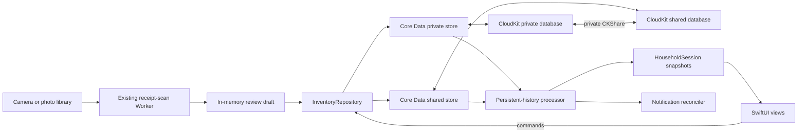

# Household sharing architecture

> Implementation contract for Tridge's household-sharing release. The implementation state lives
> in [`status.md`](./status.md). The existing visual language remains normative in
> [`design/fridge-design.html`](../design/fridge-design.html); this page is normative for the
> persistence, collaboration, Household screen, upgrade, and verification behavior added by the
> sharing release.

## Simple summary

One **household** is one shared fridge, including its fridge, freezer, and pantry items. The person
who starts it owns the CloudKit share. They send an Apple invitation to another Tridge user, and
accepted members can see and edit the same inventory. Tridge saves every change locally first, so it
continues to work without a network connection, then iCloud carries the change to the other devices.

Example: Maya has five apples in "Home." She invites Alex. Alex eats one while offline, while Maya
adds two from a receipt. Their phones immediately show four and seven respectively. After both
phones reconnect, both operations are present and both phones show six. The receipt still goes only
to the existing scan Worker; the shared inventory goes only through the household's CloudKit share.

Installed App Store and TestFlight users update normally. The sharing build starts a fresh inventory
in new database files, preserves settings and App Attest, removes obsolete expiry reminders, and
shows one explanation. Nobody must uninstall the old build.

## Closed product decisions

These choices are fixed for the first sharing release; an implementation agent must not invent a
different behavior.

| Question | Decision |
| --- | --- |
| Who can use sharing? | Apple-device users signed in to an active iCloud account. |
| Who can edit? | The owner and every accepted participant. There is no read-only product role. |
| Who can invite? | Only the owner. Public links, access requests, and participant re-invites are disabled. |
| How many fridges? | The UI has one active household at a time. It lists the personal household plus accepted households; there is no Create Household action in this release. |
| Is iCloud optional? | No for the sharing build. A signed-out or restricted account sees an account-required screen; an already validated signed-in session can continue through an ordinary network outage. |
| Is synchronization live? | No hard real-time promise. Local writes are immediate and CloudKit converges eventually. |
| What happens to concurrent quantities? | Immutable stock operations compose; no increment or decrement is overwritten by a scalar last-writer-wins merge. |
| What happens to simultaneous same-name creation? | Each device still merges against items it can already see. Independently created offline rows remain separate after sync; Tridge never destroys or combines them automatically. |
| What happens when sharing ends? | A participant leaves without a copy. An owner may stop sharing and keep a new private copy, or delete the shared fridge for everyone. |
| Is old inventory migrated? | No. Test inventory resets automatically in place; the legacy SwiftData files remain untouched for rollback. |
| Does this add a runtime dependency? | No. Use Apple frameworks and adapt Apple's sample patterns. |

Cross-platform clients, non-iCloud identities, public shares, adversarial member permissions,
grocery lists, recipes, and a manual duplicate-merging feature are out of scope. If Tridge later
needs Android/web or field-level roles, inventory must move behind a server-authoritative API.

## Why this architecture



`NSPersistentCloudKitContainer` is the Apple-supported fit for a managed object graph that needs a
local replica, private-database sync, and CloudKit Sharing. Tridge uses one model in two stores:

- the **private store** contains households owned by the current iCloud user; and
- the **shared store** contains households received from other iCloud users.

Each household is Tridge's **logical aggregate** inside one Core Data zone-wide `CKShare`; it is not
a CloudKit hierarchical-root record. `NSPersistentCloudKitContainer.share([household], to: nil)`
moves the related graph into the share's record zone. Its items and stock operations stay in that
same persistent store and share graph. Relationships never cross household, store, or share
boundaries. `CKShare` is the membership source of truth; Tridge does not create an account system or
a parallel member table.

The scan Worker remains a separate trust boundary. App Attest authorizes a Tridge installation to
use the billed receipt endpoint. CloudKit identifies an iCloud user and authorizes access to a
household. Household ids, share URLs, participant identities, CloudKit credentials, and stored
inventory never go to the Worker.

## Adopt, do not reinvent

Use these platform components directly:

| Need | Adopt | How Tridge uses it |
| --- | --- | --- |
| Local persistence and iCloud mirroring | Core Data + `NSPersistentCloudKitContainer` | One private and one shared SQLite store. |
| Create and distribute an invitation | `CKShare`, `ShareLink`, and `CKShareTransferRepresentation` | Share the Household aggregate into its zone and send the share's stable URL. |
| Restrict invitation choices | `CKAllowedSharingOptions` | Specified recipients and read/write only; access requests and participant invitations remain false. |
| Manage participants | `UICloudSharingController` | Existing system UI, wrapped for SwiftUI. Do not build a contacts or participant editor. |
| Accept invitations | `CKSharingSupported` plus application/scene delegate callbacks | Route metadata to `acceptShareInvitations(from:into:)` for the shared store. |
| Detect remote data | Persistent history and remote-change notifications | Consume a token per store and refresh value snapshots. |
| Detect share-metadata changes | `CKSystemSharingUIObserver`, container events, and foreground refresh | Share changes do not create persistent-history transactions. |
| Reference implementation | Apple's **CoreDataCloudKitShare** sample attached to its sharing guide | Adapt its two-store, invitation, history, and lifecycle patterns; preserve any copied license headers. |

Do not add a package in the first release:

- Apple's [`sample-cloudkit-sharing`](https://github.com/apple/sample-cloudkit-sharing) is a useful
  MIT-licensed raw-CloudKit reference, but it is not a Core Data sharing library.
- [`CloudKitSyncMonitor`](https://github.com/ggruen/CloudKitSyncMonitor) can turn container events
  into sync-status properties, but it does not implement history consumption, store routing,
  invitations, or inventory commands. Tridge needs only a small event reducer and the repository
  currently forbids third-party packages.
- [`Automerge`](https://github.com/automerge/automerge-swift) is a full CRDT document model. Adding
  a second persistence/conflict system beside Core Data and CloudKit would increase, not remove, the
  work. The stock-operation reducer solves the one field that cannot safely use scalar merging.

## Apple project and service configuration

The identifiers and capabilities are part of the contract:

- bundle identifier: `com.tridge.app` (unchanged, so installed builds update in place);
- CloudKit container: `iCloud.com.tridge.app`;
- add `Tridge/Tridge.entitlements` and set `CODE_SIGN_ENTITLEMENTS` for Debug and Release;
- enable iCloud with CloudKit for the container, Push Notifications, and Background Modes → Remote
  notifications;
- add `CKSharingSupported = YES` and `UIBackgroundModes = [remote-notification]` to the generated
  app Info.plist settings; and
- keep automatic signing. Debug/dev-signed builds use the CloudKit development environment;
  TestFlight/App Store builds use production.

The entitlements file contains the iCloud container identifiers/services and the ubiquity key-value
store identifier generated for the existing team. Xcode/provisioning supplies the appropriate APS
environment; do not hardcode a production push value into Debug.

Only the Apple Developer account owner can create/associate the iCloud container, enable the App ID
services, and promote a production schema. Those prerequisites are listed in
[Owner handoff](#owner-handoff). They do not block pure logic, repository, UI, or local-store work.

## Persistence contract

### Store setup

Add `Tridge/Persistence/TridgeModel.xcdatamodeld` and load it with
`NSPersistentCloudKitContainer(name: "TridgeModel")`. After CloudKit reports an available account,
fetch the current container-specific user record id, hash its record name with SHA-256, and use only
that nonlogged hash as the local account scope. Use explicit new URLs:

```text
Application Support/HouseholdSharing/Accounts/<account-scope-hash>/private.sqlite
Application Support/HouseholdSharing/Accounts/<account-scope-hash>/shared.sqlite
```

Never persist or log the raw CloudKit user record id. Persist the last successfully validated hash
only so a running, already validated session can survive an ordinary network outage. On a cold
launch, do not expose a cached account's inventory until the current account identity is validated;
if identity cannot be checked yet, show a retrying account state. Active-household ids, history
tokens, notification prefixes, sharing-transition state, and store paths are scoped by this hash.
The one-time legacy `persistenceGeneration` marker is installation-wide because its cleanup runs once
regardless of which iCloud account is active.

Both descriptions use the same model and `iCloud.com.tridge.app`. Set their CloudKit database scopes
to `.private` and `.shared` respectively. Both enable:

- `NSPersistentHistoryTrackingKey`;
- `NSPersistentStoreRemoteChangeNotificationPostOptionKey`;
- automatic/inferred lightweight migration for additive development changes; and
- `NSPersistentStoreFileProtectionKey = completeUntilFirstUserAuthentication`, so background
  imports can run after the first unlock without leaving the files unprotected.

The stack is ready only after **both** stores load. Do not `fatalError` on failure. `LaunchState`
shows loading, iCloud-account-required, or a retryable persistence error until a complete stack is
available. A partial private-only stack is not exposed to the UI because commands could be routed to
the wrong store.

Use a main-queue, read-only view context with `automaticallyMergesChangesFromParent = true` and a
store-trump merge policy. Repository writers use serial private-queue contexts, the transaction
author `app.inventory`, and an object-trump merge policy. No managed object crosses a context or is
stored in SwiftUI state; pass `NSManagedObjectID` internally and value snapshots across module
boundaries.

For every inserted Household, FridgeItem, and StockChange, the repository calls
`context.assign(_:to:)` for the household's resolved store before save. A participant-created child
must be assigned to the shared store explicitly. A relationship to an object in another store is a
programming error and fails the command before save.

Derive `Owned by you` from the Household object's persistent store (`.private`) and `Shared with you`
from `.shared`; do not infer ownership from optional participant identity fields. Fetch the
Household's `CKShare` only for share status, capabilities, invitation, and lifecycle actions.

### Exact Core Data model

Core Data class names carry a `Record` suffix so they cannot be confused with the public value
snapshots. Every persisted attribute is optional in the model and validated/filled by repository
initializers, satisfying CloudKit model rules without leaking optionals into the domain. Relationships
are optional, unordered, and have inverses. There are no unique constraints, ordered relationships,
transformable values, or `Deny` delete rules.

Use one model configuration for both store descriptions; do not split related entities across Core
Data configurations. Set each entity's Codegen to Manual/None and module to Current Product Module,
then keep the hand-written `*Record` subclasses in `Persistence/ManagedObjects` so validation and
tests compile predictably on every Xcode version.

| Entity | Attributes | Relationships |
| --- | --- | --- |
| `HouseholdRecord` | `id: UUID`, `modelVersion: Int16` (starts at `1`), `name: String`, `createdAt: Date`, `modifiedAt: Date` | `items` → many `FridgeItemRecord`, inverse `household`, Cascade |
| `FridgeItemRecord` | `id: UUID`, `modelVersion: Int16` (starts at `1`), `name: String`, `normalizedName: String`, `artKey: String`, `storageRaw: String`, `purchaseDate: Date`, `expiryDate: Date`, `expirySourceRaw: String`, `createdAt: Date`, `modifiedAt: Date` | `household` → one `HouseholdRecord`, inverse `items`, Nullify; `stockChanges` → many `StockChangeRecord`, inverse `item`, Cascade |
| `StockChangeRecord` | `id: UUID`, `modelVersion: Int16` (starts at `1`), `delta: Int64`, `reasonRaw: String`, `occurredAt: Date` | `item` → one `FridgeItemRecord`, inverse `stockChanges`, Nullify |

Set a local nonunique fetch index on `FridgeItemRecord.normalizedName`. `receiptText`, receipt images,
`quantity`, `status`, `consumedDate`, a mutable deletion flag, urgency, and Food Category are **not**
persisted:

- raw receipt text exists only in the in-memory review draft and is discarded after confirmation;
- quantity and consumption history derive from StockChange records;
- active/inactive status and deletion derive from immutable StockChange events;
- urgency derives from `expiryDate`; and
- Food Category derives from `artKey` through `ItemID.foodCategory`.

Before initializing the development schema, set `allowsCloudEncryption = true` on the user-content
attributes: household name; item name, normalized name, art key, storage, purchase/expiry dates, and
expiry source; and stock delta, reason, and occurrence date. Leave ids and bookkeeping timestamps
unencrypted. This decision must exist before production promotion because CloudKit field encryption
cannot be toggled casually after a field ships.

The repository treats a missing required value, invalid raw enum, nonfinite date, empty normalized
name, a delta invalid for its reason (including zero for a nonterminal reason), or a broken
relationship as corrupt imported data. It excludes that record from the UI, logs only
entity/id/error category, and leaves the record intact for diagnostics; it never logs the household
or item content.

## Inventory semantics

### Stock operations

`StockChange` is immutable after insertion. Its reasons are:

| Reason | Valid delta |
| --- | --- |
| `acquired` | positive; initial manual/scan add or merge/restock |
| `adjusted` | any nonzero value; committing the quantity field |
| `eaten` | exactly `-1` |
| `tossed` | exactly `-1` |
| `preserved` | positive; active inventory copied when an owner stops sharing |
| `deleted` | exactly `0`; immutable user deletion marker |
| `cleared` | exactly `0`; immutable Clear All marker |

For one item, the reducer first keeps one canonical operation per `id`, then computes:

```text
rawQuantity = sum(canonical deltas)
quantity    = max(0, rawQuantity)
isDeleted   = any canonical reason is deleted or cleared
```

Command ids are generated before a write and reused if that command is retried; the StockChange id
is that command id. A repeated id with the same payload therefore applies once. If corrupt records
reuse an id with different payloads, the Linux-testable reducer deterministically selects the
lexicographically smallest `(occurredAt, delta, reasonRaw)` tuple and emits an integrity diagnostic.
Sum with `addingReportingOverflow`; an overflow marks that item corrupt and excludes it from the UI
instead of trapping or wrapping. Repository-created operations cannot approach that limit.

Inputs from a scan, manual add, or an individual quantity edit remain `1...99`. Concurrent positive
operations can legitimately make the synchronized result exceed 99; display the real count rather
than dropping stock. A detail draft that begins above 99 remains unchanged unless the user edits it;
a new typed target is still clamped to `1...99`.

The quantity field commits one `adjusted` operation with `target - currentLocalProjection`. Remote
operations that were not yet visible still compose later, so the final synchronized value may differ
from the target. Two peers consuming the last visible unit can produce a negative raw sum, but the UI
shows zero. Once an item projects to zero, later purchases create a new item rather than paying down
the old operation history. No operation log is compacted or pruned in this release.

An item is visible/active only when `isDeleted == false` and projected quantity is greater than zero.
Delete and Clear All append immutable terminal events and never remove them. Stock or metadata
changes that arrive later cannot resurrect the item. A new purchase after deletion or zero creates a
new item record. Clear All appends one `cleared` event per active item in a single transaction, with
all operation ids allocated before the first save so the command can retry idempotently.

### Matching and scalar conflicts

Keep the current `MergePlanner` behavior, scoped to the active household: exact normalized-name
matches only, never merge into expired, zero-quantity, or deleted items, and choose the newest
eligible purchase if local data already contains more than one match. A merge appends `acquired`
stock; it does not rewrite a scalar quantity.

CloudKit's normal conflict resolution applies to concurrent edits of name, art, storage, and expiry:
one value wins and every peer eventually sees that value. Tridge does not pretend to merge two
different scalar edits. Forms use value drafts and commit once, so typing does not export every
keystroke.

Automatic cross-peer item deduplication is deliberately absent. When two offline users independently
create "Milk," both rows remain after synchronization. This is visible and recoverable; silently
combining different batches, dates, or stock histories is not. A future manual merge may be designed
separately.

## Application boundaries and modules

SwiftUI stops importing SwiftData and stops mutating persistence objects. It reads snapshots from a
main-actor `HouseholdSession` and sends commands through `InventoryRepository`.

```text
Tridge/
├─ Core/
│  ├─ InventoryCommands.swift       value commands/errors
│  ├─ InventorySnapshots.swift      HouseholdSnapshot + InventoryItemSnapshot
│  ├─ StockReducer.swift            order-independent quantity/idempotency rules
│  ├─ HouseholdSelection.swift      deterministic active-household fallback
│  └─ NotificationPlan.swift        pure desired-vs-scheduled reminder diff
├─ Persistence/
│  ├─ TridgeModel.xcdatamodeld
│  ├─ ManagedObjects/               *Record classes and validated mapping
│  ├─ PersistenceController.swift   two stores, contexts, store lookup
│  ├─ CoreDataInventoryRepository.swift
│  ├─ PersistentHistoryProcessor.swift
│  └─ HistoryTokenStore.swift
├─ Sharing/
│  ├─ HouseholdSharingService.swift CKShare create/fetch/manage/leave/stop
│  ├─ HouseholdShareItem.swift      Transferable used by ShareLink
│  ├─ ShareInvitationRouter.swift   buffers cold/warm invitation metadata
│  ├─ AppDelegate.swift             scene configuration + account events
│  ├─ SceneDelegate.swift           CloudKit invitation callbacks
│  └─ CloudKitEventMonitor.swift    setup/import/export/share status
├─ App/
│  ├─ HouseholdSession.swift        active id, snapshots, capabilities, UI state
│  └─ LaunchState.swift             loading/account/error/reset-notice states
├─ Services/
│  └─ NotificationService.swift     reconciles active-household reminders
└─ Views/Household/
   ├─ HouseholdScreen.swift
   └─ CloudSharingController.swift  UICloudSharingController bridge
```

The existing synchronized Xcode folder group picks up these files without per-file project edits.
`Package.swift` already compiles all of `Tridge/Core`, so stock, selection, command, and notification
logic remains Linux-testable. Core Data, CloudKit, UIKit, and SwiftUI stay outside `FridgeCore`.

The component responsibilities are intentionally narrow:

| Component | Sole responsibility |
| --- | --- |
| `PersistenceController` | Construct both stores, identify each loaded store/scope, create confined contexts, and report complete/failed launch. |
| `InventoryRepository` protocol | Async household queries and commands; no CloudKit presentation or SwiftUI. |
| `CoreDataInventoryRepository` | Validate commands, resolve the household/store, check capability, assign inserted objects, save atomically, and return snapshots. |
| `HouseholdSession` | Main-actor observable UI state: available/active households, active items, account/capability/sync state, and command errors. |
| `HouseholdSharingService` | Share APIs and owner/participant lifecycle; depends on a protocol so UI/lifecycle tests can use a fake. |
| `ShareInvitationRouter` | Buffer metadata received before dependency setup and serialize acceptance into the shared store. |
| `PersistentHistoryProcessor` | Consume and persist one history token per store, merge changes, then request snapshot/reminder refresh. |
| `CloudKitEventMonitor` | Reduce account, network, setup/import/export, and system-sharing notifications to a diagnostic sync state. |
| `NotificationService` | Diff desired active-household reminders against Tridge-owned pending identifiers and update badge. |

Repository commands are `addReviewedRows`, `addManualItem`, `updateItem`, `eatOne`, `tossOne`,
`deleteItem`, `clearActiveHousehold`, and `renameOwnedHousehold`. Each includes the household id and a
stable command id. The repository refetches the target inside its writer context and checks
`canUpdateRecord`, `canDeleteRecord`, or `canModifyManagedObjects(in:)` immediately before mutation.
These checks improve the error shown by the UI; CloudKit remains the authorization authority.

Every operation-producing command also carries preallocated ids for every object it may insert:

- manual add has one candidate item id and one StockChange id;
- reviewed rows have a stable candidate item id and StockChange id per row;
- update/eat/toss/delete have one StockChange id;
- Clear All has a StockChange id per item in the transaction; and
- copy-before-purge preallocates its destination household id before recording the transition.

Allocate these values before entering `context.perform` and retain them for an in-process retry. A
retry first fetches the StockChange id in the target household: an identical existing event means
that part already succeeded; a conflicting payload is an integrity error. If a reviewed row now
merges into an existing item, its candidate item id is unused but its StockChange id remains stable.
The multirow add and Clear All save atomically, so a crash cannot leave a half-applied command.

## UI contract

The Home screen keeps its existing title, grid, search, filters, and single bottom add button. It
does not gain a sync banner, account avatar, or tab bar. All existing inventory actions target the
active household supplied by `HouseholdSession`.

Settings adds one first row to its existing everyday section:

```text
🏠  Household                         Home  ›
🔔  Expiry reminder                  9 AM
🔤  Emoji-free mode                    on
📋  Copy diagnostics
```

`Clear all items…` keeps its separate destructive section, but its confirmation says, "This removes
all items from Home for everyone in this household." It appends immutable `cleared` events to the
active household's items; it is an inventory action, not a privacy-data erasure action.

The Household row opens `HouseholdScreen`:

- **Your fridges** lists every valid household with name, `Owned by you` or `Shared with you`, its
  creation date, and a checkmark on the active one. Tapping a row selects it locally and refreshes
  Home, reminders, and badge. Selection does not sync to another device.
- An accepted invitation becomes active automatically on the accepting device once its Household
  record imports. The prior personal household remains selectable.
- Every accessible household offers Export Fridge Data….
- The active owner's actions are Rename; Share Fridge… when unshared or Send Invite… when shared;
  Manage Sharing… when shared; Stop Sharing & Keep My Fridge… when shared; Delete Fridge… when
  unshared; and Delete Shared Fridge for Everyone… when shared.
- A participant sees Manage Sharing… and Leave Household…; participants do not see Rename, Invite,
  Stop, or Delete.
- The screen shows a text-plus-symbol sync state (`Up to date`, `Syncing…`, `Offline — changes will
  sync later`, or `iCloud needs attention`). It never exposes raw CloudKit errors, share URLs, or
  participant identity in diagnostics.
- Loading and destructive actions disable inventory commands and cannot be started twice.

Share Fridge/Send Invite uses `ShareLink` with a `HouseholdShareItem`. The share has title equal to
the household name and a Tridge share type. Its `CKAllowedSharingOptions` permits only specified
recipients and read/write access; both `allowsAccessRequests` and
`allowsParticipantsToInviteOthers` remain false. `publicPermission` is `.none`.

Manage Sharing presents `UICloudSharingController` for the existing share so Apple owns participant
selection/removal and permission display. Tridge does not render a custom member list because
identity fields may be unavailable and a custom list would duplicate system behavior.
Before presentation, retain the existing share zone id and Household managed-object id in the
service. If the controller delegate reports that the owner stopped sharing, feed those identifiers
into the same resumable copy-before-purge state machine; do not implement a second stop path.

Export Fridge Data writes a temporary, versioned JSON document containing export date, household
name, every active or terminal item record's scalar metadata, current quantity, and complete
stock-event history. It excludes participant/share metadata, account ids, diagnostics, receipt text,
and receipt images, then presents the system share sheet. Delete Fridge physically removes an
unshared private graph. Delete Shared Fridge for Everyone purges the shared zone without making the
owner copy and explains that every participant loses the data. A participant's Leave action
explicitly says the owner retains the shared data.

Every new control has an accessibility label/identifier, supports Dynamic Type, and communicates
state with text in addition to color. Stop, leave, delete, and clear require explicit confirmation.

## Bootstrap and active-household selection

Run selection only after both stores load and known imported history is merged:

1. If an accepted invitation is pending and its Household record has imported, select that household
   and clear the pending invitation marker.
2. Otherwise, use the locally saved `activeHouseholdID` if it still resolves to an accessible
   household.
3. Otherwise, choose the oldest owned household; break ties by UUID.
4. Otherwise, choose the oldest received household; break ties by UUID.
5. Otherwise, create `My Fridge` in the private store and select it.

Persist only the UUID in `UserDefaults`; validate it every launch. If a selected household is left,
revoked, purged, or deleted, run the same fallback immediately and reconcile reminders.

CloudKit cannot enforce a unique personal-household root. If two devices both bootstrap before they
see each other, both `My Fridge` records remain and appear in the list with creation dates. Do not
silently merge them. The owner can rename either and delete an unshared extra. This rare, explicit
outcome is safer than moving a possibly shared object graph between record zones.

## Sharing and lifecycle flows

### Create and invite

1. Resolve the active owned Household record in the private store and save any pending writes.
2. Fetch its existing share. If absent, call `NSPersistentCloudKitContainer.share([household],
   to: nil)`, configure title/type/private read-write options, and persist the returned share.
3. Use `ShareLink` to distribute the stable invitation. Canceling the share sheet does not delete the
   share or household; a later Send Invite reuses it.
4. Use `CKSystemSharingUIObserver`/share refetch to update owner/shared state because share metadata
   does not appear in persistent history.

### Accept

Both warm and cold SwiftUI launches must be handled. `SceneDelegate` receives
`CKShare.Metadata`; `ShareInvitationRouter` buffers it if persistence is not ready, verifies the
container identifier, and serially calls `acceptShareInvitations(from:into:)` with the shared store.
It records the share zone as pending selection. After import exposes the Household record, session
selection follows the bootstrap rule and shows success. Repeated metadata is idempotent. A failure
keeps the current household selected and offers Retry; it never creates a local imitation of the
shared household.

### Local inventory command

The view commits a value draft. Repository routing and all new records save in one local Core Data
transaction, then `HouseholdSession` refetches and notifications reconcile. The UI does not wait for
CloudKit export. If permission was revoked, the save is rejected with "You no longer have permission
to change this household," snapshots refresh, and the user's draft remains available to copy.

### Remote import

The container imports to a store and posts a remote-change notification. The history processor
serially fetches transactions after that store's token, excluding `app.inventory`, with
`affectedStores` set to only that store. It merges object-id changes into the view context, validates
the affected graph, refreshes session snapshots, reconciles reminders, and only then archives the
new token. Tokens are keyed by persistent-store identifier and stored outside CloudKit. Do not prune
persistent history in this release; premature pruning can invalidate mirroring state.

Share changes are refreshed separately from history after system-sharing UI changes, relevant
container events, account changes, and foreground activation. There is no unsupported "force sync"
button; foreground refresh reports local truth while `NSPersistentCloudKitContainer` performs its
normal import/export work.

### Participant leaves or is removed

Leave Household warns that the fridge will disappear from this user's devices while other members
keep it. After confirmation, call `purgeObjectsAndRecordsInZone` for the share in the shared store,
clear pending selection for that zone, choose a fallback household, and cancel its reminders. Do
not make a private copy.

When the owner removes a participant, CloudKit revokes that participant. On the removed user's
device, immediately hide the household when revocation is observed, purge any remaining local zone
objects, fall back, and reconcile notifications. The owner and other participants remain unchanged.

### Owner stops sharing and keeps inventory

This path must not lose the owner's stock. It is used both by Tridge's explicit Stop action and the
`UICloudSharingController` delegate callback if the owner stops through system UI:

1. Allocate the destination household UUID and persist a local, account-scoped transition keyed by
   source zone with phase `copying`. The phases are `copying`, `copySaved`, and `purgePending`.
   Suppress both source and destination from normal interaction until the transition completes.
2. Disable commands for the household and snapshot every item with no terminal delete/clear event and
   projected quantity greater than zero.
3. In one private-store transaction, create a new unshared Household with the preallocated UUID and
   the same name. Copy each active item's scalar metadata with fresh ids and append one fresh
   `preserved` StockChange equal to its projected quantity. Do not copy deleted/zero rows or old
   operation history.
4. Save and verify the private copy can be fetched, then advance the transition to `copySaved`. The
   copy transaction is all-or-nothing; a retry first fetches the preallocated UUID and never creates
   a second copy. If save/verification fails, do not call purge; keep the source graph and show Retry.
5. Advance to `purgePending`, then purge the old share zone and graph with
   `purgeObjectsAndRecordsInZone`.
6. Select the private copy, refresh share metadata, reminders, and badge, then clear the transition.
   If purge fails after the copy saved, keep the copy, mark cleanup retryable, and suppress the
   source household from the picker until cleanup completes.

The copy-before-purge rule follows Apple's warning that the purge API removes both CloudKit records
and the local Core Data graph. On launch, resume every incomplete transition before normal household
selection. `zoneNotFound`/`userDeletedZone` while `purgePending` means purge already completed, so
activate the verified copy and finish instead of cloning again.

### Delete household data

Delete Fridge is owner-only and appears only when no `CKShare` exists. It warns that the action is
permanent, deletes the graph from the private store, selects/creates a fallback, and reconciles
notifications. Never use this action as an implicit Stop Sharing operation.

Delete Shared Fridge for Everyone is owner-only, records a crash-safe purge transition, calls
`purgeObjectsAndRecordsInZone` without cloning, selects/creates a fallback, and reconciles
notifications. A missing zone on retry counts as already deleted. Participants cannot delete the
owner's CloudKit data; Leave removes only their access/local shared-zone mirror.

## Account and failure behavior

- **Network offline with a confirmed signed-in account:** stores and commands remain available;
  sync state says offline and CloudKit exports later.
- **No/restricted iCloud account:** clear in-memory snapshots and show a blocking "Sign in to iCloud
  to use Tridge" state. Do not show a prior account's cached inventory or create a local-only
  household.
- **Account temporarily unavailable/undetermined:** an already validated session may show its cache
  read-only, with writes disabled until the account is available; a cold launch waits/retries rather
  than guessing the account. An ordinary network outage after the account remains validated is
  local-first and permits writes.
- **Account changes:** immediately close inventory sheets, clear snapshots, disable commands, tear
  down the container (remove loaded stores from its coordinator and release all contexts) without
  deleting either account directory, validate the new account scope, and create/load that scope's
  two stores. Then run normal selection after setup/import. Never present the prior account's cached
  objects during the transition.
- **One store fails to load:** expose neither store; show Retry and a sanitized diagnostic id.
- **Import/export failure:** retain local data, show a diagnostic status, and let the container retry.
  Never delete/recreate a store as an automatic sync-error recovery.
- **User-deleted zone/encrypted-key reset:** inspect `CKError.userDeletedZone` and
  `CKErrorUserDidResetEncryptedDataKey` on zone-not-found errors. Immediately hide the affected
  household, cancel its reminders, and choose a fallback. Do not silently recreate or re-share it;
  explain that the user removed the iCloud data and offer a new empty personal household. A
  participant can ask the owner for a new invitation.
- **Read-only/unexpected permission:** capability checks disable commands and refresh share state.
  The product never intentionally creates read-only invitations.
- **Corrupt imported record:** omit only that record, record a content-free integrity diagnostic,
  and continue showing valid inventory.

## Upgrade from the shipping build

The bundle id does not change and the user does not uninstall. The sharing release never attaches
the SwiftData default store; it always opens the two explicit Core Data URLs above.

Use `persistenceGeneration = 2` in `UserDefaults` as an idempotent completion marker:

1. Load both new stores and select/bootstrap a personal household.
2. Remove all pending and delivered Tridge expiry notifications and set the badge to zero.
3. Set generation 2 only after both steps succeed. A crash before completion repeats the safe steps.
4. If the known legacy `Application Support/default.store` exists, show once: "Tridge sharing starts
   with a fresh fridge. Your settings are unchanged, and you don't need to reinstall."

Do not open, migrate, move, or delete `default.store` or its sidecars. Do not clear all
`UserDefaults`: notification hour, emoji-free mode, active App Attest key id, and other device
preferences survive. The Secure Enclave App Attest key is unrelated to the inventory store and must
not be regenerated by this reset.

The one-time reset is the only accepted migration for this test population. A later cleanup release
may remove the exact legacy files only after the new generation has been proven and separately
reviewed.

## Notifications and badge

Notifications and badge cover the **active household only**. Switching households cancels Tridge
expiry identifiers for the previous household and schedules the new one. Use identifiers
`account.<accountScope>.household.<householdUUID>.item.<itemUUID>.pre` and `.day` so accounts and
households cannot collide. The account scope is the nonlogged hash, never the raw user record id.

After every local save, processed remote-history batch, active-household switch, foreground event,
revocation, leave/stop/delete, and first-run reset:

1. Build the desired T−2-day and expiry-day requests from active snapshots and the local reminder
   hour.
2. Fetch pending requests with Tridge's identifier prefix.
3. Add, replace, or remove only the difference. Do not prompt again for notification permission on
   a remote import.
4. Set badge to the active household's expired active-item count.

The pure `NotificationPlan` diff is Linux-tested; the service is an Apple-platform adapter.

## Privacy and security

- Inventory sharing is opt-in and invite-only. CloudKit enforces membership; UI capability checks
  are not treated as authorization.
- Receipt images and raw receipt text are never written to CloudKit. The image continues through the
  disclosed Cloudflare/OpenAI scan path with `store:false`; only the confirmed, parsed inventory is
  saved.
- Do not log item/household names, stock values, participant names/emails, share URLs, CloudKit
  record payloads, or invitation metadata. Diagnostics may include opaque ids, event type, CKError
  code, store scope, and timestamp.
- Do not cache participant identity outside system APIs. Do not send membership to the scan Worker.
- Local SQLite files use data protection and eligible user-content CloudKit fields enable encrypted
  values before schema promotion.
- HouseholdScreen provides a portable JSON export. Owner Delete Fridge/Delete Shared Fridge purges
  the owned graph; participant Leave removes access but truthfully states that the owner retains the
  data. Clear All is not presented as privacy erasure because its immutable events remain.
- Before release, update the Worker-hosted privacy policy and App Store privacy answers to disclose
  iCloud storage, invited-member access, retention, export, owner deletion, participant leave, and
  user-initiated household synchronization. The current policy must remain unchanged until the
  feature ships because it describes today's local-only app. The owner makes the final App Store
  disclosure classification; the coding agent must not guess legal answers.

## Implementation sequence

One agent can implement the repository work end to end in this order. Each step is a checkpoint, not
an invitation to redesign the preceding decisions.

1. **Pure contracts:** add snapshots, commands, StockReducer, HouseholdSelection, and
   NotificationPlan with Linux tests. Keep `swift test` green.
2. **Model and launch:** add the exact Core Data model, two-store PersistenceController, launch
   states, entitlements/Info settings, and the idempotent fresh-store reset. Add macOS/iOS in-memory
   model-validation tests where CloudKit is disabled; add a `TridgeTests` Xcode test target and run
   it in macOS CI.
3. **Repository migration:** implement store routing/capabilities and move Home, detail, manual add,
   clear, and scan confirmation from SwiftData mutations to snapshots/commands. Only then delete the
   SwiftData `FridgeItem` model and all `@Query`/`modelContext` use.
4. **History and local effects:** add per-store history tokens, remote merge, event monitoring,
   session refresh, notification diffing, account transitions, and sanitized diagnostics.
5. **Sharing UI:** add Household settings/screen, ShareLink preparation, system management UI, and
   the cold/warm invitation bridge.
6. **Lifecycle and data rights:** implement leave/revoke, resumable owner copy-before-purge, owned
   private/shared deletion, JSON export, encrypted-key/user-deleted-zone handling, fallbacks, and
   failure recovery against a fake SharingService before live CloudKit testing.
7. **Repository verification:** run the full Gate, the macOS CI build/test job, inspect the final diff,
   update README, `server/src/privacy.ts`, App Store disclosure handoff, and wiki/status docs, and
   keep the implementation in one reviewable feature PR with logical Conventional Commits.
8. **CloudKit acceptance:** after owner provisioning, initialize only the development schema, run
   the two-account matrix below, then promote that exact schema and validate an update via TestFlight.

Do not call `initializeCloudKitSchema` on ordinary launch. If automation is useful, add a
`#if DEBUG`-only launch argument such as `-initializeCloudKitSchema`, fail closed outside Debug, and
document its one-time use. After initialization, Apple's `cktool` text-schema workflow may be used
to diff/verify the development schema in CI, but never to mutate production automatically.

## Verification and definition of done

### Automated

Linux `swift test` covers:

- StockChange order independence, idempotent retry, corrupt-id tie-break, concurrent add/consume,
  overflow rejection, zero projection, immutable terminal events, no resurrection, and a new batch
  after zero;
- MergePlanner remaining household-scoped and never merging expired/zero/deleted rows;
- deterministic active-household selection/fallback;
- notification desired-state diffs; and
- command validation and snapshot mapping that does not expose receipt text.

Apple-platform tests cover:

- the model passes CloudKit compatibility rules and loads two isolated test stores;
- every new object is assigned to the household's store and cross-store relationships are rejected;
- repository commands write one atomic graph and capability denial writes nothing;
- history tokens are independent per store, saved only after processing, and app-authored history is
  filtered;
- invitation metadata buffers until the shared store is ready and repeated acceptance is safe;
- owner stop saves/verifies an active-inventory copy before a purge fake is invoked;
- stop-sharing transition retries never duplicate a copy and resume after each recorded phase;
- participant leave makes no copy, owner deletion makes no copy, and export omits restricted fields;
- account-derived paths/tokens/selection differ for two user-record-id hashes; and
- account/reset state never presents a prior store snapshot.

The repository Gate remains:

```text
swift test
cd server && npm run typecheck && npm test
```

On macOS/CI, the app must also build for a generic iOS Simulator and the full Apple-platform test
suite must pass.

### Two-account acceptance

Use two different iCloud accounts and preferably two physical devices. Simulator-only tests do not
complete this contract.

- An already-installed App Store/TestFlight build updates without uninstalling, opens a fresh
  personal household, retains settings/App Attest scanning, clears old reminders, and shows the
  reset message once.
- Owner invitation accepts on a cold and a warm launch; the received household auto-selects and the
  personal household remains in the picker.
- Owner and participant can scan, manually add, edit metadata, eat, toss, delete, and clear; each
  peer eventually renders the same state.
- With both devices offline, concurrent positive operations both survive; concurrent consumes do
  not display a negative quantity; a purchase after a zero item creates a fresh row.
- Independent offline creation of the same name intentionally produces two visible rows.
- A remote expiry edit updates the other device's active-household notifications.
- Participant leave and owner revocation remove access, cancel reminders, and choose a fallback
  without affecting remaining members.
- Owner Stop Sharing retains one unshared copy with the same active item metadata/quantities and
  removes access for participants.
- Export produces a versioned JSON file without receipt/share/account data; owner deletion removes
  the private or shared graph, while participant Leave states that the owner retains it.
- Signing out/account switching never reveals the prior account's cached inventory.
- Public access, read-only choice, access requests, and participant invitations are unavailable.
- Sync/account/error/destructive controls are VoiceOver-labelled and usable with Dynamic Type and
  Reduce Motion.

The CloudKit development schema remains disposable until every item passes. Production promotion is
one-way/additive: after promotion, never remove or rename shipped entities/fields or change their
types. Future schema changes add optional/defaulted fields in a new model version.

## Owner handoff

An implementation agent can complete every repository change and CI check autonomously. These
external actions require the Apple account owner and are the only accepted handoff:

1. In Apple Developer/Xcode, create or confirm `iCloud.com.tridge.app`, associate it with
   `com.tridge.app`, and enable CloudKit, Push Notifications, and remote-notification background mode
   for the App ID/profiles.
2. Provide two iCloud test accounts/devices for invitation, account-switch, and background-push
   acceptance.
3. After development acceptance, promote the initialized CloudKit schema to production in CloudKit
   Console.
4. Run the existing TestFlight workflow and perform the upgrade/two-account acceptance checklist.
5. Review and publish the privacy-policy/App Store privacy disclosure update.

If item 1 is not ready, the agent must still finish code, fakes, local tests, unsigned simulator
build, CI, and documentation; it must report live CloudKit/TestFlight acceptance as externally
blocked rather than altering identifiers or inventing credentials.

## Official references

- [Sharing Core Data objects between iCloud users](https://developer.apple.com/documentation/coredata/sharing-core-data-objects-between-icloud-users)
- [Creating a Core Data model for CloudKit](https://developer.apple.com/documentation/coredata/creating-a-core-data-model-for-cloudkit)
- [`NSPersistentCloudKitContainer`](https://developer.apple.com/documentation/coredata/nspersistentcloudkitcontainer)
- [Consuming relevant store changes](https://developer.apple.com/documentation/coredata/consuming-relevant-store-changes)
- [Shared records and CKShare lifecycle](https://developer.apple.com/documentation/cloudkit/shared-records)
- [`CKAllowedSharingOptions`](https://developer.apple.com/documentation/cloudkit/ckallowedsharingoptions)
- [`CKShareTransferRepresentation`](https://developer.apple.com/documentation/cloudkit/cksharetransferrepresentation)
- [Accepting share invitations in a SwiftUI app](https://developer.apple.com/documentation/coredata/accepting-share-invitations-in-a-swiftui-app)
- [Build apps that share data through CloudKit and Core Data (WWDC21)](https://developer.apple.com/videos/play/wwdc2021/10015/)
- [TN3164: Debugging `NSPersistentCloudKitContainer` synchronization](https://developer.apple.com/documentation/technotes/tn3164-debugging-the-synchronization-of-nspersistentcloudkitcontainer)
- [Providing user access to CloudKit data](https://developer.apple.com/documentation/cloudkit/providing-user-access-to-cloudkit-data)
- [Responding to requests to delete data](https://developer.apple.com/documentation/cloudkit/responding-to-requests-to-delete-data)
- [Integrating a text-based CloudKit schema](https://developer.apple.com/documentation/cloudkit/integrating-a-text-based-schema-into-your-workflow)

The load-bearing choices and rejected alternatives are recorded in
[`decisions.md`](./decisions.md) → *2026-08-06* and *2026-08-08*.
