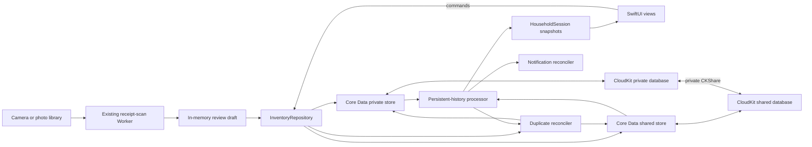

# Household sharing architecture

> Implementation contract for Tridge's household-sharing release. The implementation state lives
> in [`status.md`](./status.md); the external steps it still needs from a release owner are in
> [`release-handoff.md`](./release-handoff.md). The existing visual language remains normative in
> [`design/fridge-design.html`](../design/fridge-design.html); this page is normative for the
> persistence, collaboration, Household screen, upgrade, and verification behavior added by the
> sharing release.

## Simple summary

One **household** is one shared fridge, including its fridge, freezer, and pantry items. The person
who starts it owns the CloudKit share. They send an Apple invitation to another Tridge user, and
accepted members can see and edit the same inventory. Tridge saves every change locally first, so it
continues to work without a network connection, then iCloud carries the change to the other devices.

Example: Maya has five apples in "Home." She invites Alex. Alex eats one while offline, while Maya
adds two from a receipt. Their phones immediately show four and seven respectively. After both
phones reconnect, both operations are present and both phones show six. The receipt still goes only
to the existing scan Worker; the shared inventory goes only through the household's CloudKit share.

The existing item-grouping behavior also survives sharing. Every confirmed purchase creates a hidden
physical root carrying the Household frontier visible at that moment. If Maya and Alex each add one
"Milk" while both are offline and neither can see the other's new root, Tridge preserves both
additions but projects them as one logical Milk with quantity two after synchronization. It links the
two physical histories permanently instead of deleting either one, so an operation arriving late
still counts. An expired or explicitly deleted Milk remains a closed batch. A zero projection stays
hidden but may reappear if a delayed valid operation makes the synchronized total positive; a new
purchase still starts a fresh root.

Item names become read-only once saved in the first sharing release. A user corrects a scan name in
Review before saving; a later identity correction requires deleting and adding the item again.
Quantity, art, storage, and Expiry Day remain editable. The deliberate restriction removes a
distributed rename/split protocol from the first release.

Clear All also has an offline-safe rule. If Maya and Alex both clear while offline, neither clear
"wins" by deleting the other's later work. Each clear creates a branch in the household's causal
inventory frontier, so groceries added after either clear remain after synchronization. A later
Clear All performed after both branches are visible replaces both branches and clears their items.

Installed App Store and TestFlight users update normally. The sharing build creates new database
files, migrates every still-active legacy item into the user's first owned Household, preserves
settings and App Attest, replaces obsolete expiry reminders, and retains the old database until the
user explicitly erases it. Nobody must uninstall the old build.

## Closed product decisions

These choices are fixed for the first sharing release; an implementation agent must not invent a
different behavior.

| Question | Decision |
| --- | --- |
| Who can use sharing? | Tridge users on supported iPhone and iPad versions who are signed in to an active iCloud account. |
| Who can edit? | The Household owner and every accepted Household member. There is no read-only product role. |
| Who can invite? | Only the Household owner. Public links, access requests, and member re-invites are disabled. |
| Can the Household owner remove one member? | Not in the first rollout. There is no Manage Sharing UI. The Household owner may stop or delete the whole share; a member may leave. |
| How many owner installations? | The first rollout supports one Tridge installation signed into a given Household owner's iCloud account. This is a documented/tested rollout constraint, not an enforced device lock. |
| How many fridges? | The UI has one Active Household at a time. It lists the personal Household plus accepted Households; there is no Create Household action in this release. |
| Is iCloud optional? | No for the sharing build. A signed-out or restricted account sees an account-required screen; an already validated signed-in session can continue through an ordinary network outage. |
| Is synchronization live? | No hard real-time promise. Local writes are immediate and CloudKit converges eventually. |
| What happens to concurrent quantities? | Immutable stock operations compose; no increment or decrement is overwritten by a scalar last-writer-wins merge. |
| What happens to simultaneous same-name creation? | Exact-name active items converge permanently to one logical item. Tridge retains every physical row and stock event, joins them with immutable merge claims, sums the histories, and never transfers then deletes a duplicate. |
| How is a purchase recorded? | Every manual or receipt purchase creates a hidden physical root stamped with the complete current Household frontier. Exact-name active roots may immediately project as one logical item. |
| What metadata does a same-name purchase use? | It copies established canonical metadata. Only art, storage, or Expiry Day fields explicitly edited by the user are applied to the canonical item. |
| Can an item be renamed after saving? | No in the first sharing release. Correct its name during Review; later, delete and add it again. Quantity, art, storage, and Expiry Day remain editable. |
| Is zero permanent? | No. Zero hides the current projection, and a new purchase creates a fresh root. A delayed valid operation may revive the old projection; only explicit Delete is an item-level tombstone. |
| What does Clear All mean offline? | It advances a causal household inventory frontier. Items from a superseded frontier stay in history but cannot reappear when an offline device reconnects. Concurrent clear branches coexist, so groceries added after either clear survive; a later clear that has imported both branches supersedes both. |
| What happens when sharing ends? | A Household member leaves without a copy. A Household owner may stop sharing and keep the data already visible on that installation, after a warning that another member's unseen offline edits cannot be recovered, or delete the shared fridge for everyone. |
| Does an accepted invitation change the active fridge? | No. The imported Household appears in the list and the member selects it explicitly. |
| Is old inventory migrated? | Yes. Every active legacy item migrates automatically into the sharing upgrade's first owned Household. Eaten and tossed rows stay only in the retained legacy archive, which has a separate explicit local-erasure action. |
| Does this add a runtime dependency? | No package currently fits the account-isolated, two-store event contract. The repository's evidence-based policy still permits a reviewed dependency when one materially reduces risk. |

Cross-platform clients, non-iCloud identities, public shares, concurrent installations signed into
the same Household owner's iCloud account, adversarial member permissions, grocery lists, recipes,
and a user-facing manual merge tool are out of scope. If Tridge later needs Android/web or
field-level roles, Inventory must move behind a server-authoritative API.
Household members are trusted collaborators: imported-data validation limits accidental corruption,
but it is not a security boundary against a member running a modified client.

## Why this architecture



`NSPersistentCloudKitContainer` is the Apple-supported fit for a managed object graph that needs a
local replica, private-database sync, and CloudKit Sharing. Tridge uses one model in two stores:

- the **private store** contains households owned by the current iCloud user; and
- the **shared store** contains households received from other iCloud users.

Each household is Tridge's **logical aggregate** inside one Core Data zone-wide `CKShare`; it is not
a CloudKit hierarchical-root record. `NSPersistentCloudKitContainer.share([household], to: nil)`
moves the related graph into the share's record zone. Its items and stock operations stay in that
same persistent store and share graph, along with its item-merge links. Relationships never cross
household, store, or share boundaries. `CKShare` is the membership source of truth; Tridge does not
create an account system or a parallel member table.

The scan Worker remains a separate trust boundary. App Attest authorizes a Tridge installation to
use the billed receipt endpoint. CloudKit identifies an iCloud user and authorizes access to a
household. Household ids, share URLs, participant identities, CloudKit credentials, and stored
inventory never go to the Worker.

## Adopt, do not reinvent

Use these platform components directly:

| Need | Adopt | How Tridge uses it |
| --- | --- | --- |
| Local persistence and iCloud mirroring | Core Data + `NSPersistentCloudKitContainer` | One private and one shared SQLite store. |
| Create and distribute an invitation | `CKShare`, `ShareLink`, and `CKShareTransferRepresentation` | Share the Household aggregate into its zone and send the share's stable URL. |
| Restrict invitation choices | `CKAllowedSharingOptions` | Specified recipients and read/write only; access requests and participant invitations remain false. |
| Accept invitations | `CKSharingSupported` plus application/scene delegate callbacks | Route metadata to `acceptShareInvitations(from:into:)` for the shared store. |
| Detect remote data | Persistent history and remote-change notifications | Consume a token per store and refresh value snapshots. |
| Present overall sync health | `NSPersistentCloudKitContainer.Event`, `NWPathMonitor`, and the account coordinator | Reduce only events belonging to the current session's loaded store identifiers. |
| Detect share-metadata changes | `CKSystemSharingUIObserver`, container events, and foreground refresh | Share changes do not create persistent-history transactions. |
| Reference implementation | Apple's **CoreDataCloudKitShare** sample attached to its sharing guide | Adapt its two-store, invitation, history, and lifecycle patterns; preserve any copied license headers. |

`SyncStatusProviding` is a main-actor protocol with `currentStatus`, an `AsyncStream<SyncStatus>` of
updates, `prepareSession(generation:)`, `activateSession(generation:storeIdentifiers:)`, and
`endSession(generation:)`. Its domain enum is exactly `.upToDate`, `.syncing`, `.offline`, and
`.needsAttention`. `AccountSessionCoordinator` creates a fresh random generation and calls
`prepareSession` **before** `loadPersistentStores`, then calls `activateSession` with the exact two
loaded store identifiers after both descriptions finish. Ending a session clears every in-flight
or buffered event and subscription owned by that generation.

`StoreScopedSyncMonitor` installs its
`NSPersistentCloudKitContainer.eventChangedNotification` observer during `prepareSession`, before a
store load can start setup/import work. Until activation it buffers event snapshots by
`event.identifier`, retaining their `storeIdentifier`, type, start, and completion. Activation
discards buffered events for every store except the two just loaded, replays the remaining starts
and completions in notification order, and then accepts live starts only for those identifiers. A
completion is accepted only when its start was recorded for the still-current generation and store.
A completion from account A that arrives while account B loads or after B activates is therefore
dropped. Timestamps are diagnostic data, never the isolation boundary. `NWPathMonitor` supplies
reachability; the account coordinator remains authoritative for whether stores may open or writes
may proceed.

Mapping precedence is deterministic: an unavailable/restricted account or a current-session
non-network setup/import/export failure is `.needsAttention`; a validated account with an
unavailable network is `.offline`; any current-session in-progress event or incomplete initial
setup/import is `.syncing`; successful setup and import for both current stores, with exports either
not started or successful, is `.upToDate`. A successful initial private-store import is also the
bootstrap barrier described below; store loading alone is not that barrier. The label is diagnostic
only and never claims that another device has already received a change.

[`CloudKitSyncMonitor` 3.1.0](https://github.com/ggruen/CloudKitSyncMonitor/blob/3.1.0/Sources/CloudKitSyncMonitor/SyncMonitor.swift)
was evaluated but is not adopted. Its process-wide reducer copies type/timestamps/result from
`NSPersistentCloudKitContainer.Event` and drops `storeIdentifier`, so an adapter cannot prove that a
published completion belongs to the active account's stores. Using it only for reachability and
account status would not justify a runtime dependency. The other alternatives were evaluated, not
rejected merely because they are dependencies:

- Apple's [`sample-cloudkit-sharing`](https://github.com/apple/sample-cloudkit-sharing) is a useful
  MIT-licensed raw-CloudKit reference, but it is not a Core Data sharing library.
- [`SyncKit`](https://github.com/mentrena/SyncKit) owns CloudKit record synchronization itself and
  would compete with `NSPersistentCloudKitContainer`; it is not a sharing-lifecycle wrapper.
- [`Automerge`](https://github.com/automerge/automerge-swift) is a full CRDT document model. Adding
  a second persistence/conflict system beside Core Data and CloudKit would increase, not remove, the
  work. Tridge needs immutable stock events, inventory epochs, and permanent exact-name merge claims.

Future dependencies are allowed when a decision entry records the concrete gap, alternatives,
license, maintenance/security/privacy posture, exact version policy, and replacement boundary. A
package is not justified solely by reducing a few lines of domain-specific code.

## Apple project and service configuration

The identifiers and capabilities are part of the contract:

- bundle identifier: `com.tridge.app` (unchanged, so installed builds update in place);
- CloudKit container: `iCloud.com.tridge.app`;
- add `Tridge/Tridge.entitlements` and set `CODE_SIGN_ENTITLEMENTS` for Debug and Release;
- enable iCloud with CloudKit for the container, Push Notifications, and Background Modes → Remote
  notifications;
- add `CKSharingSupported = YES` and `UIBackgroundModes = [remote-notification]` to the generated
  app Info.plist settings; and
- keep automatic signing. Debug/dev-signed builds use the CloudKit development environment;
  TestFlight/App Store builds use production.

The entitlements file contains the iCloud container identifiers/services and the ubiquity key-value
store identifier generated for the existing team. Xcode/provisioning supplies the appropriate APS
environment; do not hardcode a production push value into Debug.

An Apple Developer Program Account Holder or authorized Admin can create/associate the iCloud
container and enable App ID services; CloudKit Console access is role-based. Those prerequisites are
listed in [Release handoff](#release-handoff). They do not block pure logic, repository, UI, or
local-store work.

## Persistence contract

### Store setup

Add `Tridge/Persistence/TridgeModel.xcdatamodeld` and load it with
`NSPersistentCloudKitContainer(name: "TridgeModel")`. After CloudKit reports an available account,
fetch the current container-specific user record id, hash its record name with SHA-256, and use only
that nonlogged hash as the local account scope. Use explicit new URLs:

```text
Application Support/HouseholdSharing/Accounts/<account-scope-hash>/private.sqlite
Application Support/HouseholdSharing/Accounts/<account-scope-hash>/shared.sqlite
```

Never persist or log the raw current-account CloudKit user record id as account identity; persist
only the last successfully validated hash so a running, already validated session can survive an
ordinary network outage. Opaque record/zone components may exist only inside a protected,
account-scoped lifecycle transition when reconstructing those exact CloudKit targets is required to
resume a purge/deletion; never log them and clear them with the completed transition. On a cold
launch, do not expose a cached account's inventory until the current account
identity is validated; if identity cannot be checked yet, show a retrying account state.
Active-household ids, history tokens, notification prefixes, sharing-transition state, and store
paths are scoped by this hash. The upgrade's persistence, legacy-side-effect cleanup, migration
acknowledgement, and legacy-store erasure markers are installation-wide because they describe this
installation rather than an iCloud account. The account binding and destination Household recorded
by the migration remain explicit so the same archive is never migrated into a later account.

Both descriptions use the same model and `iCloud.com.tridge.app`. Set their CloudKit database scopes
to `.private` and `.shared` respectively. Both enable:

- `NSPersistentHistoryTrackingKey`;
- `NSPersistentStoreRemoteChangeNotificationPostOptionKey`;
- automatic/inferred lightweight migration for additive development changes; and
- `NSPersistentStoreFileProtectionKey = completeUntilFirstUserAuthentication`, so background
  imports can run after the first unlock without leaving the files unprotected.

The stack is ready only after **both** stores load. Do not `fatalError` on failure. `LaunchState`
shows loading, iCloud-account-required, or a retryable persistence error until a complete stack is
available. A partial private-only stack is not exposed to the UI because commands could be routed to
the wrong store.

Use a main-queue, read-only view context with `automaticallyMergesChangesFromParent = true` and a
store-trump merge policy. Repository writers use serial private-queue contexts, the transaction
author `app.inventory`, and an object-trump merge policy. Duplicate reconciliation uses a separate
serial context with author `app.reconcile`. No managed object crosses a context or is stored in
SwiftUI state; pass `NSManagedObjectID` internally and value snapshots across module boundaries.

For every inserted Household, FridgeItem, StockChange, ItemMerge, and HouseholdClear, the repository
calls `context.assign(_:to:)` for the household's resolved store before save. A member-created
child must be assigned to the shared store explicitly. A relationship to an object in another store
is a programming error and fails the command before save.

Derive `Owned by you` from the Household object's persistent store (`.private`) and `Shared with you`
from `.shared`; do not infer ownership from optional participant identity fields. Fetch the
Household's `CKShare` only for share status, capabilities, invitation, and lifecycle actions.

### Exact Core Data model

Core Data class names carry a `Record` suffix so they cannot be confused with the public value
snapshots. Every persisted attribute is optional in the model and validated/filled by repository
initializers, satisfying CloudKit model rules without leaking optionals into the domain. Relationships
are optional, unordered, and have inverses. There are no unique constraints, ordered relationships,
transformable values, or `Deny` delete rules.

Use one model configuration for both store descriptions; do not split related entities across Core
Data configurations. Set each entity's Codegen to Manual/None and module to Current Product Module,
then keep the hand-written `*Record` subclasses in `Persistence/ManagedObjects` so validation and
tests compile predictably on every Xcode version.

| Entity | Attributes | Relationships |
| --- | --- | --- |
| `HouseholdRecord` | `id: UUID`, `modelVersion: Int16` (starts at `1`), `name: String`, `initialInventoryEpochID: UUID`, `createdAt: Date`, `modifiedAt: Date` | `items` → many `FridgeItemRecord`, inverse `household`, Cascade; `itemMerges` → many `ItemMergeRecord`, inverse `household`, Cascade; `clearEvents` → many `HouseholdClearRecord`, inverse `household`, Cascade |
| `FridgeItemRecord` | `id: UUID`, `modelVersion: Int16` (starts at `1`), `name: String`, `normalizedName: String`, `inventoryEpochContextRaw: String`, `artKey: String`, `storageRaw: String`, `purchaseDay: Int32`, `expiryDay: Int32`, `expirySourceRaw: String`, `createdAt: Date`, `modifiedAt: Date` | `household` → one `HouseholdRecord`, inverse `items`, Nullify; `stockChanges` → many `StockChangeRecord`, inverse `item`, Cascade |
| `StockChangeRecord` | `id: UUID`, `modelVersion: Int16` (starts at `1`), `delta: Int64`, `reasonRaw: String`, `occurredAt: Date` | `item` → one `FridgeItemRecord`, inverse `stockChanges`, Nullify |
| `ItemMergeRecord` | `id: UUID`, `modelVersion: Int16` (starts at `1`), `leftItemID: UUID`, `rightItemID: UUID`, `createdAt: Date` | `household` → one `HouseholdRecord`, inverse `itemMerges`, Nullify |
| `HouseholdClearRecord` | `id: UUID`, `modelVersion: Int16` (starts at `1`), `epochID: UUID`, `parentEpochIDsRaw: String`, `revision: Int64`, `occurredAt: Date` | `household` → one `HouseholdRecord`, inverse `clearEvents`, Nullify |

`ItemMergeRecord` is an immutable, permanent exact-name identity claim. Its endpoint ids are
different, sorted by UUID byte order (`leftItemID < rightItemID`), and must resolve to items in the
same Household and persistent store whose immutable normalized names match and whose inventory
contexts are both active in the current frontier. The two contexts need not be identical: items
added after two concurrent clears may still converge by name. Duplicate claims for the same
endpoints are valid and have the same union effect, which makes concurrent reconciliation idempotent
without a CloudKit-incompatible uniqueness constraint.

`HouseholdClearRecord` is an immutable edge in a causal epoch graph. The initial node is revision
`0` with `HouseholdRecord.initialInventoryEpochID`. `parentEpochIDsRaw` and
`FridgeItemRecord.inventoryEpochContextRaw` are the same canonical encoding: a JSON array of
lowercase UUID strings, sorted by UUID byte order, unique, and nonempty. A Clear All captures the
entire current frontier as its parent set, creates a fresh `epochID`, and sets `revision` to one plus
the greatest parent revision. The current frontier is every reachable epoch with no outgoing valid
clear edge; the initial epoch is the frontier before the first clear.

Two offline clears from the same frontier therefore create two leaf epochs instead of a winner and
loser. Their records reduce in any order to a frontier containing both leaves. An item captures the
device's entire visible frontier when it is created. That context is a set of independent supporting
branches, not an all-or-nothing dependency: the item is current while **at least one** captured epoch
remains in the reduced frontier. Thus an item added after either concurrent clear stays current
after the branches meet, and an item created after seeing both branches remains supported if a later
offline clear supersedes only one of them. An item created before those clears has no surviving
captured epoch and stays hidden. A later Clear All that has imported both leaves lists both as
parents and replaces them with one new leaf, removing the last support for items on either branch.
This is the causal boundary, not wall-clock time or UUID ordering.

The Linux reducer topologically validates parents against the initial epoch or another valid clear
record and requires `revision == max(parent revisions) + 1`. Import order does not matter: a child
whose parent has not arrived is pending for that reduction and is reconsidered after every relevant
history batch. A missing parent stays pending indefinitely; elapsed time or an offline peer is never
evidence of corruption. A noncanonical/empty context, repeated epoch id with a conflicting payload,
provable cycle, nonpositive revision, or overflow is corrupt and cannot suppress valid inventory.
Duplicate records with the same id and payload reduce once.

Set local nonunique fetch indexes on `FridgeItemRecord.normalizedName`, each ItemMerge endpoint, and
`HouseholdClearRecord.revision`. Epoch contexts are reduced per household and are not used as an
exact-string query index.

`InventoryDay` is the Linux-testable value used for Purchase Day and Expiry Day. Its persisted raw
value is a signed Gregorian day ordinal relative to 1970-01-01; converting to or from a displayed
date never uses an absolute midnight instant. Validate the ordinal before mapping it into a
snapshot. `createdAt`, `modifiedAt`, and every `occurredAt` remain absolute instants.

`receiptText`, receipt images, `quantity`, `status`, `consumedDate`, a mutable deletion flag,
urgency, and Food Category are **not** persisted:

- raw receipt text exists only in the in-memory review draft and is discarded after confirmation;
- quantity and consumption history derive from StockChange records;
- active/inactive status and deletion derive from immutable StockChange events;
- urgency derives from `expiryDay`; and
- Food Category derives from `artKey` through `ItemID.foodCategory`.

Before initializing the development schema, set `allowsCloudEncryption = true` on the user-content
attributes: household name; item name, normalized name, art key, storage, purchase/expiry days, and
expiry source; stock delta, reason, and occurrence date; and the clear occurrence date. Leave ids,
epoch revisions and bookkeeping timestamps unencrypted, including ItemMerge endpoint ids. This
decision must exist before production promotion because CloudKit field encryption cannot be
toggled casually after a field ships.

The repository treats a missing required value, invalid raw enum or InventoryDay ordinal, nonfinite event
instant, empty normalized name, a normalized name different from applying `NameKey` to the current
name, a delta invalid for its reason (including zero for a nonterminal reason), or a broken
relationship as corrupt imported data. An invalid/self/cross-household ItemMerge endpoint or a
claim joining different immutable normalized names is corrupt. The repository
excludes corrupt records from the UI, logs only entity/id/error category, and leaves them intact for
diagnostics; it never logs the household or item content.

## Inventory semantics

### Stock operations

`StockChange` is immutable after insertion. Its reasons are:

| Reason | Valid delta |
| --- | --- |
| `acquired` | positive; the initial stock attached to one fresh manual/receipt purchase root |
| `adjusted` | any nonzero value; committing the quantity field |
| `eaten` | exactly `-1` |
| `tossed` | exactly `-1` |
| `preserved` | positive; active inventory copied when an owner stops sharing |
| `deleted` | exactly `0`; immutable user deletion marker |

For one logical item, the reducer collects StockChange records from every physical item connected by
valid permanent ItemMerge claims, keeps one canonical operation per `id` across that whole set, then
computes:

```text
rawQuantity = sum(canonical deltas)
quantity    = max(0, rawQuantity)
isDeleted   = any canonical reason is deleted
```

Command ids are generated before a write and reused if that command is retried; the StockChange id
is that command id. A repeated id with the same payload therefore applies once. If corrupt records
reuse an id with different payloads, the Linux-testable reducer deterministically selects the
lexicographically smallest `(occurredAt, delta, reasonRaw)` tuple and emits an integrity diagnostic.
Sort those canonical operations by StockChange UUID byte order before summing with
`addingReportingOverflow`. Overflow means any intermediate in that canonical order overflows; it
marks the item corrupt and excludes it from the UI instead of trapping or wrapping. Repository-
created operations cannot approach that limit.

Inputs from a scan, manual add, or an individual quantity edit are positive whole numbers
representable as `Int64`; there is no smaller product cap. Reject zero, negative, nonnumeric, and
out-of-representation inputs instead of silently clamping them. Display the real synchronized count.

The quantity field commits one `adjusted` operation with `target - currentLocalProjection`. Remote
operations that were not yet visible still compose later, so the final synchronized value may differ
from the target. Two peers consuming the last visible unit can produce a negative raw sum, but the UI
shows zero. Zero is a projection, not a terminal event: a delayed valid operation may make the total
positive and visible again. A manual/receipt purchase made while the prior group is locally zero
creates a fresh purchase root rather than paying down the old operation history. A stale detail save
whose group is no longer active is rejected and offers Add as New instead. No operation log is
compacted or pruned in this release.

The projector first discards physical members whose captured inventory context has no intersection
with the household's current frontier, then applies permanent merge claims among the remaining
members. A resulting item group is visible/active only when `isDeleted == false` and projected
quantity is greater than zero. Delete never removes records or merge claims. It appends the same
immutable `deleted` StockChange id/payload to every physical member in the current connected group;
the grouped reducer counts that id once. Because saved names and merge claims never change, a linked
history cannot later split and expose an unterminated member. A terminal event on any member closes
the current group, so stock or metadata changes that arrive later cannot resurrect it. A previously
unseen, unlinked row is not retroactively deleted without causal evidence. Clear All uses the
stronger household barrier below. A new purchase after deletion or zero creates a new item record
stamped with the complete current frontier.

Clear All is a Household-wide causal barrier. In one transaction it inserts a preallocated
`HouseholdClearRecord` whose parents are the complete current frontier. It does not append an item-
level StockChange. Projection, matching, and commands then use the new leaf. An item created before
that clear, including one not yet imported, has a superseded context: its history remains exportable
but it cannot reappear. An item added concurrently from the parent context may appear locally and
then disappear when the clear arrives, preserving the release's clear-wins rule for concurrent add
versus clear.

Concurrent clears are different because each creates a child of the same parent frontier. Both
children remain leaves after synchronization, so items created after either clear remain visible.
When a later device has imported both leaves, its next Clear All names both as parents and
supersedes both branches. Retrying one command reuses the clear-record and epoch ids; concurrent
commands keep their distinct ids and converge without a tie-break winner.

### Matching and lossless same-item convergence

Keep the user-visible grouping eligibility, scoped to the active Household: exact normalized-name
matches only and never group a new purchase with an expired, zero-quantity, or deleted item. The rule
has one statement, `PurchasePlanner` in `Tridge/Core/InventoryCommands.swift`, which reads the
Household's projected snapshots (ADR 0014). Persistence changes underneath that UI behavior. Every confirmed manual or receipt
purchase inserts a fresh `FridgeItemRecord` stamped with the complete current inventory frontier and
one positive `acquired` StockChange. When an eligible logical group is already visible, initialize
the new root from its canonical metadata so a random UUID does not change the displayed name, art,
storage, or dates; any deliberate editable-field change in the purchase form is then applied once to
the canonical member resolved after insertion. The snapshot projector immediately infers the same-
name link, and `DuplicateReconciler` persists it after the atomic purchase save. No scalar quantity
is rewritten.

Each purchase-row draft starts with an empty `explicitMetadataFields` set. Direct user interaction
with art, storage, or Expiry Day adds that field; scan guesses, inferred art, and form defaults do
not. The immutable purchase command carries the final values plus that set, so retries make the same
decision. Item Name determines matching before save but is never an after-match metadata override.

That same behavior applies when peers create before they can see one another. Physical
`FridgeItemRecord` rows are durable operation-history anchors; `ItemMergeRecord` is an add-only,
permanent claim that two immutable exact-name identities represent the same logical item. The
Linux-testable `ItemGroupReducer` computes connected components with a union-find reduction. Claim
order and duplicate claims do not matter. The logical item id and canonical physical member are the
smallest member UUID by byte order, so every peer chooses the same identity and metadata source.

After every local inventory save and relevant remote-history import, `DuplicateReconciler` examines
the current logical groups in that household and current inventory frontier. It links two groups
when both contexts are current, both groups are active, nonzero, unexpired, and have the same
nonempty normalized name. It writes a star
from the lowest logical item id to each other group using a serial maintenance context and
transaction author `app.reconcile`. A claim stores only its two sorted endpoint ids. Immediately
before save, the writer refetches the endpoints and verifies their household, inventory contexts,
active quantities, expiry, and equal normalized names. If two peers still insert the same claim
concurrently, duplicates remain harmless. The snapshot projector applies the same candidate union
in memory immediately, so the UI never needs to flash duplicate rows while durable claims export.
Eligibility uses one injected `now`/Calendar snapshot and the same end-of-expiry-day rule as
`UrgencyLogic`. Once created, a structurally valid claim is permanent; later time or quantity changes
do not split the histories.

Reconciliation never copies StockChange records, rewrites their item relationship, or deletes a
physical FridgeItem. Quantity is the sum of the unique operations across every member. Therefore a
late operation written by an offline peer to either original Milk still appears in the one logical
Milk. A sequential second purchase and two simultaneous offline purchases all create separate causal
roots but have the same one-row visible outcome.

For a linked group, the lowest-id physical member is canonical and supplies the logical item's name,
art, storage, Purchase Day, Expiry Day, and expiry source. Stock-only commands do not change
`modifiedAt`. An art, storage, or expiry edit resolves the current component inside its writer
transaction, updates only that canonical member, and sets its `modifiedAt` to `now`. This rule is
deterministic and deliberately avoids a separate metadata-event protocol.

An Item Name is editable in a manual or receipt-review draft but immutable once saved. The
repository exposes no saved-name update command, and Item Detail always presents the name as
read-only. A later correction means deleting the logical item and adding it again. This keeps every
exact-name merge permanent and removes split/replacement-claim behavior from the first release.

Commands and stale sheets may address the logical id or any member id; the repository resolves the
current permanent component inside its writer context and verifies every member's inventory context
against the freshly reduced frontier. Manual and receipt purchases always create the fresh root
described above. Eat, toss, and quantity adjustment append their operation to the lowest-id member.
Delete appends its one stable
terminal id/payload to **every** member resolved in that writer transaction, matching the fan-out
rule above; a retry fills any missing member marker and treats identical existing markers as
success. Clear All uses the household frontier barrier above. A previously unseen, unlinked
same-name row that arrives only after an individual Delete is treated as a new batch rather than
destroyed: the system has no causal evidence that it predates that item-specific deletion. Clear All
is different because its explicit causal barrier suppresses every superseded context.

Expired, zero, terminal, inactive-context, and superseded-context groups are never auto-linked to
active groups, and groups with different normalized names are ineligible. Two different contexts
that each intersect the current concurrent frontier **are** eligible, so Milk added after each of
two offline clears still converges to one logical Milk. This preserves the shipping rule that
buying Milk after the old Milk expires or reaches zero creates a fresh physical root with its own
causal context. If a zero group later revives through a delayed operation and is again active and
unexpired, normal exact-name reconciliation may link it to another active root. Every structurally
valid ItemMerge claim remains active until the household is deleted; it
is never deactivated or removed. There is no user-facing manual split/unmerge operation in this
release.

CloudKit/Core Data's normal property-level conflict handling applies to concurrent edits of the
canonical member's art, storage, and expiry fields. Edits to different fields may both survive; if
two peers edit the same field, the platform-selected value wins and both replicas eventually show
it. Tridge does not add a timestamp winner, Lamport clock, or metadata event log in this release.
Forms use value drafts and commit once, so typing does not export every keystroke.

## Application boundaries and modules

SwiftUI stops importing SwiftData and stops mutating persistence objects. It reads snapshots from a
main-actor `HouseholdSession` and sends commands through `InventoryRepository`.

```text
Tridge/
├─ Core/
│  ├─ InventoryCommands.swift       value commands/errors
│  ├─ InventorySnapshots.swift      HouseholdSnapshot + InventoryItemSnapshot
│  ├─ StockReducer.swift            order-independent quantity/idempotency rules
│  ├─ ItemGroupReducer.swift        permanent claim union + deterministic projection
│  ├─ InventoryEpochReducer.swift   causal frontier codec + Clear All graph reduction
│  ├─ HouseholdSelection.swift      deterministic active-household fallback
│  └─ NotificationPlan.swift        pure desired-vs-scheduled reminder diff
├─ Persistence/
│  ├─ TridgeModel.xcdatamodeld
│  ├─ ManagedObjects/               *Record classes
│  ├─ PersistenceController.swift   two stores, contexts, store lookup
│  ├─ InventoryProjection.swift     validated record mapping + reduced projection
│  ├─ CoreDataInventoryRepository.swift
│  ├─ DuplicateReconciler.swift     creates permanent exact-name claims
│  ├─ PersistentHistoryProcessor.swift
│  └─ HistoryTokenStore.swift
├─ Sharing/
│  ├─ HouseholdSharingService.swift CKShare create/fetch/leave/stop/delete
│  ├─ HouseholdShareItem.swift      Transferable used by ShareLink
│  ├─ ShareInvitationRouter.swift   validates/buffers cold/warm invitation metadata
│  ├─ AppDelegate.swift             scene configuration + account events
│  ├─ SceneDelegate.swift           CloudKit invitation callbacks
│  └─ StoreScopedSyncMonitor.swift  current-store events → Tridge sync state
├─ App/
│  ├─ AccountSessionCoordinator.swift account validation, monitor/store startup, bootstrap gate
│  ├─ AccountTaskRegistry.swift     generation-bound task admission + cancel/drain
│  ├─ HouseholdSession.swift        active id, snapshots, capabilities, UI state
│  └─ LaunchState.swift             loading/account/error/migration-notice states
├─ Services/
│  └─ NotificationService.swift     reconciles active-household reminders
└─ Views/Household/
   └─ HouseholdScreen.swift
```

The existing synchronized Xcode folder group picks up these files without per-file project edits.
`Package.swift` already compiles all of `Tridge/Core`, so stock/grouping, selection, command, and
notification logic remains Linux-testable. Core Data, CloudKit, Network, UIKit, and SwiftUI stay
outside `FridgeCore`.

The component responsibilities are intentionally narrow:

| Component | Sole responsibility |
| --- | --- |
| `PersistenceController` | Construct both stores, identify each loaded store/scope, create confined contexts, and report complete/failed launch. |
| `AccountSessionCoordinator` | Validate/hash the iCloud account, prepare sync observation before store load, activate it with loaded identifiers, wait for initial private import when required, and invalidate/drain the whole generation on account change. |
| `AccountTaskRegistry` | Admit setup/store-load/repository/history/sharing/reminder tasks only for the current generation, cancel cooperative work, await every registered task before store teardown, and reject late results. |
| `InventoryRepository` protocol | Async household queries and commands; no CloudKit presentation or SwiftUI. |
| `CoreDataInventoryRepository` | Validate commands, resolve the household/store, check capability, assign inserted objects, save atomically, and return snapshots. |
| `HouseholdSession` | Main-actor observable UI state: available/active households, active items, account/capability/sync state, and command errors. |
| `HouseholdSharingService` | Share APIs plus explicit owner/member lifecycle; depends on a protocol so UI/lifecycle tests can use a fake. |
| `ShareInvitationRouter` | Validate and temporarily buffer warm/cold metadata until the current account's shared store is ready, then serialize one pending acceptance into that store. |
| `DuplicateReconciler` | Persist immutable exact-name links after local saves/imports; never transfer or delete item histories. |
| `PersistentHistoryProcessor` | Consume one history stream per store, run reconciliation, merge changes, refresh snapshots/reminders, then persist the token. |
| `StoreScopedSyncMonitor` | Buffer setup/import events during store loading, then reduce only current-generation events for the two activated store identifiers plus reachability into Tridge sync state; it does not authorize account/store access. |
| `NotificationService` | Diff desired active-household reminders against Tridge-owned pending identifiers, remove pending and delivered alerts for obsolete account/household scopes, and update badge. |

Every loaded-store async call carries an immutable `AccountSessionContext` containing the random
generation, account-scope hash, and both loaded store identifiers; pre-load work carries the
`AccountGenerationContext` defined below. Repository commands, persistent-history work, duplicate
reconciliation, share/lifecycle operations, and reminder refreshes register with
`AccountTaskRegistry` before touching a context. `HouseholdSession` accepts a snapshot, error, or
sync update only when its generation still equals the coordinator's current generation. This check
occurs at the main-actor apply boundary even for work that was already running when an account
notification arrived.

The coordinator creates an immutable `AccountGenerationContext` (random generation + account-scope
hash) immediately after account validation and before constructing/loading stores. After both stores
load, it derives `AccountSessionContext` by adding their identifiers. Implement
`AccountTaskRegistry` as an actor with `run(generation:operation:)` for pre-load work and
`run(context:operation:)` for loaded-store work. Each entry point compares the supplied generation
to the open generation, creates and records the child task **before** starting its operation, and
removes it only after the operation actually returns. Call sites do not launch unregistered account-
bound `Task` work. Its transition operation atomically closes admission and invalidates the
generation, cancels every recorded child, then awaits every child value; cancellation never counts
as completion while a wrapped `context.perform` body is still executing.

The dual `loadPersistentStores` call itself runs as one registered generation task that completes
only after callbacks for both descriptions arrive. A callback captures its generation, never
activates a stale session, and records any successfully loaded store for later removal. If an
account change arrives after zero or one load callback, invalidation closes activation, drain waits
for both callbacks, teardown removes every store loaded for that old generation, and only then may
the next account construct/load its container.

An account transition invalidates the generation and closes task admission first, closes inventory
UI, and clears visible snapshots. The registry then cancels cooperative tasks and **awaits every
registered operation**, including a noncancelable `context.perform` already saving to the old store.
Only after the registry drains does the coordinator end sync observation, remove/release the old
stores and contexts, validate the new account, and prepare its generation. A write already committed
to account A may remain in A's isolated store, but no A result can apply to account B and no task can
touch a removed persistent store.

Repository commands are `addReviewedRows`, `addManualItem`, `updateItem`, `eatOne`, `tossOne`,
`deleteItem`, `clearActiveHousehold`, and `renameOwnedHousehold`. Each includes the household id and a
stable command id. The repository refetches the target inside its writer context and checks
`canUpdateRecord`, `canDeleteRecord`, or `canModifyManagedObjects(in:)` immediately before mutation.
These checks improve the error shown by the UI; CloudKit remains the authorization authority.

Every operation-producing command also carries preallocated ids for every object it may insert:

- manual add has one candidate item id and one StockChange id;
- reviewed rows have a stable candidate item id and StockChange id per row;
- quantity-adjust/eat/toss commands have one StockChange id; metadata-only updates insert no stock
  event, and delete fans its one terminal id/payload out to every current physical member;
- Clear All has one clear-record id and one epoch id; and
- copy-before-purge preallocates its destination household id before recording the transition.

Duplicate reconciliation is an internal maintenance operation, not a user command. It preallocates
an ItemMerge id for each missing sorted endpoint claim, refetches the pair inside its writer
context, and saves every still-eligible claim for one household atomically. A retry or concurrent
duplicate claim has the same union result.

Allocate these values before entering `context.perform` and retain them for an in-process retry. A
retry first fetches the StockChange id in the target household: an identical existing event means
that part already succeeded; a conflicting payload is an integrity error. Every reviewed row uses
its preallocated item id for its fresh purchase root. The multirow add and Clear All save atomically,
so a crash cannot leave a half-applied command.

Delete is the fan-out exception to that singular retry shortcut. Each attempt resolves the complete
permanently linked physical member set in its writer transaction, fetches **all** StockChange rows with
the command id, and verifies an identical `deleted` payload exists on every resolved member. It
inserts the marker for each missing member in the same save, treats duplicate identical rows as
success, and rejects any conflicting payload. Finding the id on only one member never completes the
retry.

## UI contract

The Home screen keeps its existing title, grid, search, filters, and single bottom add button. It
does not gain a sync banner, account avatar, or tab bar. All existing inventory actions target the
active household supplied by `HouseholdSession`, and it renders one row per projected logical item,
not one row per physical FridgeItemRecord.

Item Detail presents every saved name as read-only while keeping quantity, art, storage, and expiry
editable. Manual Add and receipt Review keep the name editable until the new item is saved.

Settings adds one first row to its existing everyday section:

```text
🏠  Household                         Home  ›
🔔  Expiry reminder                  9 AM
🔤  Emoji-free mode                    on
📋  Copy diagnostics
```

`Clear all items…` keeps its separate destructive section. Its confirmation says, "This clears the
current inventory in Home for everyone. Items added on an offline device before it receives this
clear will also disappear when that device syncs." It advances the household inventory frontier and
replaces the currently observed frontier with one causal child. It writes no item-level StockChange
and is an inventory action, not a privacy-data erasure action.

The Household row opens `HouseholdScreen`:

- **Your fridges** lists every valid household with name, `Owned by you` or `Shared with you`, its
  creation date, and a checkmark on the active one. Tapping a row selects it locally and refreshes
  Home, reminders, and badge. Selection does not sync to another device.
- An accepted invitation adds the imported Household to this list without changing the Active
  Household. The member selects it explicitly.
- Every accessible household offers Export Fridge Data….
- The active Household owner's actions are Rename; Share Fridge… when unshared or Send Invite… when shared;
  Stop Sharing & Keep My Fridge… when shared; Delete Fridge… when unshared; and Delete Shared
  Fridge for Everyone… when shared. Individual member removal is not available in this release.
- An upgraded installation whose archived SwiftData store still exists also shows Erase Old Local
  Inventory… in a separate data-controls section. It is device-local and does not delete a current
  household or any CloudKit record.
- A Household member sees Leave Household…; members do not see Rename, Invite, Stop, or Delete.
  There is no Manage Sharing action or second system-UI leave path.
- The screen shows a text-plus-symbol sync state (`Up to date`, `Syncing…`, `Offline — changes will
  sync later`, or `iCloud needs attention`). It never exposes raw CloudKit errors, share URLs, or
  member identity in diagnostics.
- Loading and destructive actions disable inventory commands and cannot be started twice.

Share Fridge/Send Invite uses `ShareLink` with a `HouseholdShareItem`. The share has title equal to
the household name and a Tridge share type. Its `CKAllowedSharingOptions` sets
`allowedParticipantAccessOptions = .specifiedRecipientsOnly` and
`allowedParticipantPermissionOptions = .readWrite`, which are available from iOS 16 and therefore
cover the iOS 18 deployment target. CI and release builds use Xcode 26 with the iOS 26 SDK. Leave
`publicPermission` at `.none`; on iOS 26, explicitly keep `allowsAccessRequests` and
`allowsParticipantsToInviteOthers` false. This is not a general ban on newer APIs: use an iOS 26 API
behind an availability check when it materially improves the app.

`HouseholdShareItem.transferRepresentation` uses `CKShareTransferRepresentation` and returns
`.existing(share, container: container, allowedSharingOptions: options)`. The share must already be
saved server-side by the create/invite flow; do not use `.prepareShare`, which is the representation
for creating and saving a new share. Supported-device acceptance verifies whether this ShareLink
surface can expose a stop-sharing, administrator, or participant-management action. If it can, the
first rollout is blocked until a compliant invitation route is selected; do not add a hidden
management path, custom participant editor, or lifecycle preflight to compensate.

Export Fridge Data writes a temporary, versioned JSON document containing export date, household
name, each logical item's projected metadata/current quantity, every physical member record, every
ItemMerge claim, every household clear/epoch record, and complete stock-event history—including
zero, deleted, and superseded-context rows. It excludes member/share metadata, account
ids, diagnostics, receipt text, and receipt images, then presents the system share sheet. Delete
Fridge physically removes an unshared private graph. Delete Shared Fridge for Everyone purges the
shared zone without making the owner copy and explains that every Household member loses the data.
A member's Leave action explicitly says the Household owner retains the shared data.

Every new control has an accessibility label/identifier, supports Dynamic Type, and communicates
state with text in addition to color. Stop, leave, delete, and clear require explicit confirmation.

## Bootstrap and active-household selection

`loadPersistentStores` completion means the local replicas opened; it does not mean the first
CloudKit import finished. `AccountSessionCoordinator` activates the prepared sync session after both
stores load and waits for the current generation's successful private-store setup and initial
import before it may use the empty-store fallback below. Only then does it merge imported history,
run DuplicateReconciler once for every valid household in both stores, build projections, and run
selection:

1. Use the locally saved `activeHouseholdID` if it still resolves to an accessible Household.
2. Otherwise, choose the oldest owned Household; break ties by UUID.
3. Otherwise, choose the oldest received Household; break ties by UUID.
4. Otherwise, create `My Fridge` in the private store and select it.

Persist only the UUID in `UserDefaults`; validate it every launch. If a selected household is left,
revoked, purged, or deleted, run the same fallback immediately and reconcile reminders.

Persist `initialPrivateImportSucceeded` by account scope and private-store identifier only after the
monitor accepts that successful current-generation import. A new/empty account-scoped cache with no
such marker never creates `My Fridge` while setup/import is pending, offline, or failed; it stays in
a retryable "Finishing iCloud setup…" launch state. Once the barrier succeeds, an empty private
store is evidence for step 4. Existing nonempty validated caches and explicit post-delete fallback
do not wait for a fresh import merely to render local data. This gate prevents an ordinary fresh
installation from creating a duplicate household while its existing cloud household is still
importing.

The first rollout supports one owner installation and does not attempt to enforce that constraint.
CloudKit cannot provide an offline exclusive-device lock or a unique personal-Household root. If the
same Household owner's iCloud account nevertheless bootstraps two fresh installations concurrently,
both `My Fridge` records may remain and appear in the list with creation dates; do not silently merge
them. The Household owner may rename either and delete an unshared extra, but this topology is
outside the rollout guarantee.

## Sharing and lifecycle flows

### Create and invite

1. Resolve the active owned Household record in the private store and save any pending writes.
2. Fetch its existing share. If absent, call `NSPersistentCloudKitContainer.share([household],
   to: nil)`, configure title/type/private read-write options, and persist the returned share.
   If a share already exists, compare its title to the current household name. A rename saves the
   Household first, then updates `CKShare.SystemFieldKey.title` and calls
   `persistUpdatedShare(_:in:)`; a failed metadata write leaves an account-scoped retry marker.
3. Before every Send Invite, refresh the share, persist the current household title if needed, and
   require that write to succeed before presenting `ShareLink`. Thus a reused invitation never
   knowingly displays a stale fridge name. Canceling the share sheet does not delete the share or
   household; a later Send Invite reuses it.
4. Use `CKSystemSharingUIObserver`/share refetch to update owner/shared state because share metadata
   does not appear in persistent history.

CloudKit caps a share at 100 participants and a container at 1,000 custom zones. If share creation
or invitation acceptance returns a platform-limit error, leave Inventory and the active selection
unchanged and show a clear retryable error. Do not add a participant cache, custom counter, or
parallel quota system for the first rollout.

### Accept

Both warm and cold scene delivery must be handled. A connected scene receives metadata through
`windowScene(_:userDidAcceptCloudKitShareWith:)`; a cold scene reads
`connectionOptions.cloudKitShareMetadata` in `scene(_:willConnectTo:options:)`. Both routes pass the
same `CKShare.Metadata` to `ShareInvitationRouter`. The router verifies the container identifier and
waits for the current iCloud account plus shared persistent store before accepting. Metadata may be
buffered only in memory for that live process; Tridge persists no invitation URL, zone hash, phase,
or auto-selection intent.

Call `acceptShareInvitations(from:into:)` only when `participantStatus == .pending`, and serialize
that call into the current account's shared store. Already accepted metadata does not invoke
acceptance again; `.removed` or `.unknown` produces a clear reopen/error path instead of guessing.
After successful acceptance, normal CloudKit import adds the received Household to the Household
list without changing `activeHouseholdID`. If the process terminates after server acceptance, the
later import still makes the Household discoverable. If it terminates before acceptance, the user
reopens the invitation. A recoverable live-process failure keeps the current Household active and
offers Retry while metadata remains in memory; it never creates a local imitation of the shared
Household.

### Local inventory command

The view commits a value draft. Repository routing and all new records save in one local Core Data
transaction. DuplicateReconciler then persists any missing permanent exact-name claims;
`HouseholdSession` refetches the logical projection and notifications reconcile. The UI does not wait
for CloudKit export. If permission was revoked, the save is rejected with "You no longer have
permission to change this household," snapshots refresh, and the user's draft remains available to
copy.

### Remote import

The container imports to a store and posts a remote-change notification. The history processor
serially fetches transactions after that store's token, excluding `app.inventory` and
`app.reconcile`, with `affectedStores` set to only that store. It merges object-id changes into the
view context, validates the affected graph, runs DuplicateReconciler for affected households,
refreshes session snapshots, reconciles reminders, and only then archives the new token. Tokens are
keyed by persistent-store identifier and stored outside CloudKit. Do not prune persistent history in
this release; premature pruning can invalidate mirroring state.

Share changes are refreshed separately from history after relevant container events, invitation
activity, account changes, and foreground activation. There is no unsupported "force sync"
button; foreground refresh reports local truth while `NSPersistentCloudKitContainer` performs its
normal import/export work.

### Household member leaves

Leave Household warns that the fridge will disappear from this user's devices while other members
keep it. After confirmation, call `purgeObjectsAndRecordsInZone` for the share in the shared store,
then verify that no managed objects from that zone remain locally. If the server zone is already
missing, delete any remaining local graph in a confined shared-store transaction and verify its
absence before choosing a fallback Household and canceling reminders.
Do not make a private copy.

The first rollout has no individual owner-removal action. To revoke everyone, the Household owner
uses Stop Sharing or Delete Shared Fridge for Everyone. A member device that later observes lost
access immediately hides the Household, purges any remaining local zone objects, falls back, and
reconciles notifications.

### Owner stops sharing and keeps inventory

CloudKit provides no acknowledgement proving that every Household member and every one of their devices
has exported its offline operations. Tridge therefore promises to preserve the owner's current local
projection, not unseen peer edits. The explicit Stop action is available only while the owner's
account/network are available and the two local stores have no in-progress or failed sync event. Its
second confirmation says: "Only changes already synced to this device will be kept. Changes still
offline on someone else's device may be lost. Ask everyone to open Tridge online before you stop
sharing." The destructive button is "Stop Anyway." Local success still is not presented as proof
that peers uploaded. Tridge's explicit action is the only Stop Sharing entry point.

The resumable path must not lose stock already visible to the owner:

1. Allocate the destination Household UUID and persist a local, account-scoped transition keyed by
   source zone with phase `copying`. The phases are `copying`, `copySaved`, and `purgePending`.
   Suppress both source and destination from normal interaction until the transition completes.
2. Close command admission for the Household, await every already-admitted local writer, then
   refetch and snapshot every current logical item group with no `deleted` event and projected
   quantity greater than zero. This is a local quiescence barrier, not a cross-device lock.
3. In one private-store transaction, create a new unshared Household with the preallocated UUID and
   the same name plus a fresh initial inventory epoch. Copy each active logical group's canonical
   metadata once with a fresh item id stamped into that epoch, and append one fresh
   `preserved` StockChange equal to its aggregate projected quantity. Do not copy physical aliases,
   ItemMerge claims, clear epochs, deleted/zero rows, or old operation history.
4. Save and verify the private copy can be fetched, then advance the transition to `copySaved`. The
   copy transaction is all-or-nothing; a retry first fetches the preallocated UUID and never creates
   a second copy. If save/verification fails, do not call purge; keep the source graph and show Retry.
5. Advance to `purgePending`, then purge the old share zone and graph with
   `purgeObjectsAndRecordsInZone`. Whether that succeeds or reports an already-missing server zone,
   verify that the source graph is absent from the local private store; if necessary, delete the
   remaining local graph in a confined transaction and verify again.
6. Select the private copy, refresh share metadata, reminders, and badge, then clear the transition.
   If purge fails after the copy saved, keep the copy, mark cleanup retryable, and suppress the
   source household from the picker until cleanup completes.

The copy-before-purge rule follows Apple's warning that the purge API removes both CloudKit records
and the local Core Data graph. On launch, resume every confirmed copy/purge transition before normal
Household selection. `zoneNotFound`/
`userDeletedZone` while `purgePending` proves only that the remote zone is absent. Run the local
absence/cleanup check from step 5 before activating the verified copy and finishing; never clone
again.

### Delete household data

Delete Fridge is owner-only and appears only when no `CKShare` exists. It warns that the action is
permanent. Never use this action as an implicit Stop Sharing operation. Because a local Core Data
delete only queues a CloudKit export, Tridge does not call the action complete merely because the
local graph disappeared. The action is available only while the account and network are available
and the private store has no in-progress or failed sync event, then uses the existing account-scoped
lifecycle-transition store:

1. Close command admission for the Household and await every already-admitted local writer. Resolve
   the complete private graph, capture every CloudKit record ID returned by
   `NSPersistentCloudKitContainer.recordIDs(for:)`, and persist the household ID, record-name/zone-
   name/zone-owner components, and phase `privateDeletePrepared` before mutation. These opaque
   components are never logged. Objects with no mapped CloudKit record need only local deletion.
2. Delete the graph in one private-store transaction, select/create a fallback, reconcile
   notifications, hide the target household, advance to `privateDeleteAwaitingCloud`, and show
   `Deleting from iCloud…` rather than success. On retry, `privateDeletePrepared` deletes the graph
   if it is still present or advances when it is already absent.
3. After the next successful current-generation private-store export completion observed after the
   delete save, fetch the captured record IDs from the private CloudKit database. The export event
   alone is not confirmation. Completion requires every ID to return
   `CKError.Code.unknownItem`; a present record or any other fetch error keeps the transition
   retryable. If the captured set is empty, the local save completes the transition immediately.
4. Clear the transition and show the permanent-deletion completion only after that absence check.
   On launch, resume a pending check before exposing the household. If the app is interrupted or
   uninstalled first, it never claimed that CloudKit deletion completed.

This adds no deletion backend or parallel sync engine: Core Data still performs the deletion, the
existing store-scoped monitor supplies the export event, and a read-only CloudKit fetch verifies the
server result. This completion guarantee assumes the supported single owner installation. A second
concurrent installation for the same Household owner's iCloud account could later export data from
another cache; the
first rollout does not claim to prevent that unsupported topology.

Delete Shared Fridge for Everyone is owner-only, records a crash-safe purge transition, calls
`purgeObjectsAndRecordsInZone` without cloning, selects/creates a fallback, and reconciles
notifications. A missing remote zone on retry still requires verified cleanup of any remaining local
source graph before completion. Because members have read/write access, CloudKit permits them to
modify or delete records included in the share; Tridge treats them as trusted collaborators. What a
member's Leave action cannot do is delete the owner's `CKShare` or zone: it removes only that
member's participation and local shared-zone mirror.

Erase Old Local Inventory is separate from household deletion because the archived pre-sharing
store is installation-wide and has no safe account/household mapping. After explicit confirmation,
resolve and validate exactly `Application Support/default.store` plus its known `-wal` and `-shm`
sidecar URLs. Every existing target must be a regular local file rather than a symbolic link and
must be outside `HouseholdSharing/`; any mismatch fails closed. With no context or store attached to
it, if the base file exists, call the current typed
`NSPersistentStoreCoordinator.destroyPersistentStore(at:type:options:)` for that exact URL and
`.sqlite`. After successful store destruction—or on Retry when the base file is already absent—use
`FileManager.removeItem` only for those same validated base/sidecar URLs that still exist. Treat
file-not-found as success; any other destroy or removal error shows Retry. Mark erasure complete only
after all three exact paths are absent. Never enumerate the directory, follow a link, broaden the
target, or touch current Core Data stores. Current household Delete actions disclose that this old
local archive is controlled by the separate action while it exists.

## Account and failure behavior

- **Network offline with a confirmed signed-in account:** stores and commands remain available;
  sync state says offline and CloudKit exports later.
- **No/restricted iCloud account:** clear in-memory snapshots and show a blocking "Sign in to iCloud
  to use Tridge" state. Do not show a prior account's cached inventory or create a local-only
  household.
- **Account temporarily unavailable/undetermined:** an already validated session may show its cache
  read-only, with writes disabled until the account is available; a cold launch waits/retries rather
  than guessing the account. An ordinary network outage after the account remains validated is
  local-first and permits writes.
- **Account changes:** invalidate the current generation, close task admission and inventory UI,
  clear snapshots, and disable commands. Cancel cooperative work and await `AccountTaskRegistry`
  drain; stale callbacks are rejected again at the main-actor apply boundary. Only then tear down
  the container (remove loaded stores from its coordinator and release all contexts) without
  deleting either account directory, validate the new account scope, and create/load that scope's
  two stores. Then run normal selection after setup/import. Never present the prior account's cached
  objects during the transition.
- **One store fails to load:** expose neither store; show Retry and a sanitized diagnostic id.
- **Import/export failure:** retain local data, show a diagnostic status, and let the container retry.
  Never delete/recreate a store as an automatic sync-error recovery.
- **User-deleted zone:** handle `CKError.Code.userDeletedZone` separately and obtain confirmation
  before purging associated local data, as Apple requires. Hide the affected Household from normal
  interaction while the choice is pending, cancel its reminders, and never describe this as an
  encryption-key reset.
- **Encrypted-data-key reset:** detect `CKErrorUserDidResetEncryptedDataKey` in the `userInfo` of the
  accompanying zone-not-found error and follow Apple's recovery guide. For an owned Household,
  obtain confirmation, delete and recreate the affected private record zone, rebuild its share
  state, and upload the validated local cache. A Household member cannot authoritatively recreate
  its owner's zone: hide that received Household, choose a fallback, and require a fresh invitation
  from the Household owner.
- **Read-only/unexpected permission:** capability checks disable commands and refresh share state.
  The product never intentionally creates read-only invitations.
- **Corrupt imported record:** omit only that record, record a content-free integrity diagnostic,
  and continue showing valid inventory.

## Upgrade from the shipping build

The bundle id does not change and the user does not uninstall. The app's normal runtime opens only
the two explicit Core Data URLs above. A dedicated, one-time legacy reader opens the exact SwiftData
store only long enough to migrate active rows; it is never attached to the new UI or sharing stack
and never saves back into the archive.

Use separate installation-wide markers for side-effect cleanup, migration completion, migration
notice acknowledgement, and legacy erasure. Completing one responsibility never implies that
another happened:

1. Before checking iCloud or opening an account-scoped store, if
   `legacyEffectsCleanupGeneration < 2`, remove every pending and delivered notification owned by
   Tridge, set the app badge to zero, then set that marker to `2`. This path also runs when iCloud is
   signed out or restricted, so legacy reminders cannot keep notifying while migration waits.
2. Record whether the exact legacy `Application Support/default.store` exists. Never move or
   automatically delete it or its sidecars.
3. Validate iCloud, load both new stores, pass the initial-import bootstrap barrier, and create the
   account's first owned Household if it does not already exist. That first owned Household is the
   migration destination; a received Household is never eligible.
4. If the archive exists and `legacyMigrationGeneration < 2`, read every legacy row whose status is
   `active`. Validate the complete set before writing. In one private-store transaction, create one
   physical item per active legacy row with its name, art, storage, Expiry Source, positive current
   quantity, and Purchase/Expiry Days converted from the calendar days the old app displayed. Add
   one `acquired` StockChange for that current quantity. Capture one Gregorian calendar/time-zone
   snapshot for the migration and use it for every legacy row before storing the resulting day
   ordinals. Use the legacy item UUID as the stable migration command id, so retrying after a crash
   recognizes an identical completed row rather than adding it twice. Eaten and tossed rows are not
   migrated.
5. Raw legacy `receiptText` is not copied. New receipt-line text exists only in the in-memory review
   draft and is discarded after confirmation; old receipt text remains solely in the retained local
   archive until the user explicitly erases that archive.
6. If any active row cannot be mapped, save none of them, retain the archive, and show a retryable
   migration error. After the transaction can be refetched with every expected command id, persist
   `legacyMigrationGeneration = 2` together with the destination account scope and Household id,
   then reconcile current reminders and the badge. A later iCloud account never receives the same
   archive automatically.
7. If `legacyMigrationNoticeAcknowledgedGeneration < 2`, explain: "Your current fridge was moved
   into Household sharing. Eaten and tossed history stays only in the old local archive." Set the
   acknowledgement marker to `2` only when the user taps Continue; termination before that tap makes
   the notice appear again.
8. Keep Erase Old Local Inventory available until the exact legacy store and sidecars are gone. That
   user-requested path is the only deletion of those files in this release.

Set `persistenceGeneration = 2` only after the new stack, cleanup, and any required active-item
migration succeed. A crash repeats only incomplete idempotent work. Do not clear all `UserDefaults`:
notification hour, emoji-free mode, active App Attest key id, and other device preferences survive.
The Secure Enclave App Attest key is unrelated to the inventory store and is not regenerated.

## Notifications and badge

Notifications and badge cover the **active household only**. Switching households cancels Tridge
expiry identifiers for the previous household and schedules the new one. Use identifiers
`account.<accountScope>.household.<householdUUID>.item.<logicalItemUUID>.pre` and `.day` so accounts
and households cannot collide. A newly imported lower-id merge member can change the logical id;
the desired-state diff removes the obsolete identifier in the same reconciliation. The account
scope is the nonlogged hash, never the raw user record id.

After every local save, processed remote-history batch, active-household switch, reminder-hour
change, foreground event, revocation, leave/stop/delete, and legacy cleanup/migration:

1. Build the desired T−2-day and expiry-day requests from active snapshots and the local reminder
   hour.
2. Fetch pending requests with Tridge's identifier prefix.
3. Add, replace, or remove only the difference. Do not prompt again for notification permission on
   a remote import.
4. Set badge to the active household's expired active-item count.

Account and household transitions additionally carry the exact old identifier prefix into
`NotificationService` before snapshots or account state are cleared. The service fetches both
pending requests and `deliveredNotifications()`, removes matching pending ids, and calls
`removeDeliveredNotifications(withIdentifiers:)` for matching alerts still visible in Notification
Center. An account switch uses the old account prefix; an active-household switch, leave,
revocation, stop, or delete uses the old account-plus-household prefix. Prefix parsing is strict and
never uses a broad substring, so another current household's notification is not removed.

The pure `NotificationPlan` diff is Linux-tested; the service is an Apple-platform adapter.

## Privacy and security

- Inventory sharing is opt-in and invite-only. CloudKit enforces membership; UI capability checks
  are not treated as authorization.
- Receipt images and raw receipt text are never written to CloudKit. The image continues through the
  disclosed Cloudflare/OpenAI scan path with `store:false`; only the confirmed, parsed inventory is
  saved.
- Do not log item/household names, stock values, member names/emails, share URLs, CloudKit
  record payloads, or invitation metadata. Diagnostics may include opaque ids, event type, CKError
  code, store scope, and timestamp. Remove the shipping parser's malformed-response body excerpt
  before this release; even a truncated public log can contain receipt-line text or item names.
- Do not cache member names/emails or build profiles outside system APIs. Protected lifecycle
  transitions may retain only opaque record/zone components needed to reconstruct their exact purge
  or deletion target. Do not send membership to the scan Worker.
- Local SQLite files use data protection and eligible user-content CloudKit fields enable encrypted
  values before schema promotion.
- HouseholdScreen provides a portable JSON export. A Household owner's Delete Fridge/Delete Shared
  Fridge actions purge the owned graph; Household member Leave removes access but truthfully states
  that the Household owner retains the data. Clear All is not presented as privacy erasure because
  its immutable causal epoch and older inventory history remain. Erase Old Local Inventory destroys
  the archived pre-sharing SQLite store on this device; it does not claim to delete current CloudKit
  data.
- Before release, update the Worker-hosted privacy policy and App Store privacy answers to disclose
  iCloud storage, invited-member access, retention, export, owner deletion, member leave, and
  user-initiated household synchronization. The current policy must remain unchanged until the
  feature ships because it describes today's local-only app. The sharing implementation PR does
  **not** edit `server/src/privacy.ts`, because any merged `server/**` change may deploy before the
  app release. It instead gives the release owner exact proposed copy in the release handoff. After
  two-account development acceptance and once the first sharing TestFlight/App Store rollout is
  approved, a separate release-only PR updates and deploys the policy immediately before that build
  is distributed. Review `Tridge/PrivacyInfo.xcprivacy` in the same release pass and update it only
  if Apple's manifest rules require a declaration for the implemented data flow. The release owner
  makes the final App Store disclosure classification; the coding agent must not guess legal
  answers.

## Implementation sequence

One agent can implement the repository work end to end in this order. Each step is a checkpoint, not
an invitation to redesign the preceding decisions.

1. **Pure contracts:** add snapshots, commands, StockReducer, ItemGroupReducer,
   InventoryEpochReducer, HouseholdSelection, and NotificationPlan with Linux tests. Keep
   `swift test` green.
2. **Model and launch:** add the exact Core Data model, two-store PersistenceController, launch
   states, entitlements/Info settings, and the idempotent active-inventory migration. Add macOS/iOS
   in-memory model-validation tests where CloudKit is disabled; add a `TridgeTests` Xcode test target
   and run it in macOS CI.
3. **Repository migration:** implement store routing/capabilities and move Home, detail, manual add,
   clear, and scan confirmation from SwiftData mutations to snapshots/commands. Add
   DuplicateReconciler and make snapshots group inferred/persisted merge claims before removing all
   runtime `@Query`/`modelContext` use. Keep the legacy SwiftData schema isolated behind the one-time
   migration reader for upgrades.
4. **History and local effects:** implement the store/session-scoped sync-event monitor and
   generation-bound `AccountTaskRegistry`, then add per-store history tokens, remote reconciliation,
   session refresh, notification diffing, account transitions with invalidate/cancel/drain before
   store teardown, and sanitized diagnostics.
5. **Sharing UI:** add Household settings/screen, ShareLink preparation, and the in-memory cold/warm
   invitation bridge. Accepted Households enter the list without changing the active selection; do
   not add Manage Sharing or a pending-invitation store.
6. **Lifecycle and data rights:** implement leave/access-loss cleanup, resumable owner copy-before-purge, owned
   private/shared deletion, JSON export, encrypted-key/user-deleted-zone handling, fallbacks, and
   failure recovery against a fake SharingService before live CloudKit testing.
7. **Repository verification:** run the full Gate, the macOS CI build/test job, inspect the final diff,
   update README and wiki/status docs, prepare the exact privacy-policy/App Store disclosure handoff
   without changing `server/src/privacy.ts`, and keep the implementation in one reviewable feature
   PR with logical Conventional Commits.
8. **CloudKit acceptance:** after owner provisioning, initialize only the development schema, run
   the two-account matrix below with development builds, then promote that exact schema. Coordinate
   the separate privacy-policy release and validate an update via TestFlight.

Do not call `initializeCloudKitSchema` on ordinary launch. If automation is useful, add a
`#if DEBUG`-only launch argument such as `-initializeCloudKitSchema`, fail closed outside Debug, and
document its one-time use. After initialization, Apple's `cktool` text-schema workflow may be used
to diff/verify the development schema in CI, but never to mutate production automatically.

## Verification and definition of done

### Automated

Linux `swift test` covers:

- StockChange order independence, idempotent retry, corrupt-id tie-break, concurrent add/consume,
  overflow rejection, zero projection, revival by a delayed valid operation, explicit-Delete
  terminal behavior, and a fresh purchase root after zero;
- `PurchasePlanner` eligibility remaining household-scoped and never grouping a purchase with an
  expired, zero-quantity, or deleted item;
- ItemGroupReducer claim-order independence, duplicate-claim idempotency, deterministic logical id
  and lowest-id canonical metadata member, summed late operations across members, permanent claims,
  and no active-to-expired/zero/terminal inference;
- InventoryEpochReducer canonical-context validation, input-order independence, retry idempotency,
  causal frontier reduction, pre-clear suppression without item-level clear events, concurrent-clear
  branch preservation, an item with two captured branches surviving a clear of only one branch, and
  a later multi-parent clear joining/superseding every observed branch;
- deterministic active-household selection/fallback;
- notification desired-state diffs plus exact obsolete-scope prefix selection;
- a reminder-hour change replacing otherwise-identical pending requests with the new fire dates; and
- command validation and snapshot mapping that does not expose receipt text.

Apple-platform tests cover:

- the model passes CloudKit compatibility rules and loads two isolated test stores;
- every new object is assigned to the household's store and cross-store relationships are rejected;
- repository commands write one atomic graph and capability denial writes nothing;
- every purchase creates a fresh root carrying the complete current frontier and one `acquired`
  event; a sequential same-name root copies established canonical metadata, explicitly edited
  purchase fields apply to the post-insert canonical member, untouched scan guesses/defaults do not,
  and the purchase immediately projects with the existing group; reconciliation makes concurrent
  active same-name roots one snapshot
  without deleting any root, duplicate claims remain harmless, and a late member operation changes
  the aggregate; every saved name is read-only, metadata edits target the lowest-id physical member,
  different-field concurrent edits may both survive, and same-field concurrent edits converge
  without promising a winner;
- Delete fans one stable terminal id/payload across every currently linked physical member, so a
  later claim cannot expose a member that the user deleted; a retry with markers present
  on only some members fills the missing markers before reporting success;
- Clear All writes only its full-parent-frontier barrier; a later import from a superseded context
  remains hidden, an item supported by another concurrent branch survives, two concurrent clears
  retain additions made after either branch, and a later clear that observes both supersedes both;
- history tokens are independent per store, saved only after processing, and app-authored history is
  filtered;
- `StoreScopedSyncMonitor` captures a setup/import start and completion emitted before store-load
  callbacks finish, replays it after activation, ignores buffered/live other-store events,
  completions whose start belongs to a prior generation, and account A completions received while
  account B prepares or runs;
- a new empty account cache cannot bootstrap before a successful current-generation private import;
  a cache whose cloud household arrives in that import selects it instead of creating a duplicate;
- invitation metadata buffers until the shared store is ready; warm callbacks and cold
  `connectionOptions` delivery use the same router, and only `.pending` metadata invokes CloudKit
  acceptance;
- invitation metadata, URLs, zone hashes, and selection intent are never persisted; an imported
  accepted Household enters the list without changing `activeHouseholdID`, while termination before
  acceptance requires reopening the invitation;
- share-creation and invitation-acceptance platform-limit failures leave Inventory and
  `activeHouseholdID` unchanged and create no custom quota/member state;
- a shared-household rename persists the new `CKShare` title; Send Invite retries a dirty title and
  does not present ShareLink after a metadata-write failure;
- `HouseholdShareItem` registers `.specifiedRecipientsOnly` and `.readWrite`, leaves the two
  convenience properties at their documented false defaults, and the Xcode 26/iOS 26 SDK build
  preserves the iOS 18 deployment target;
- neither role sees Manage Sharing, and no `UICloudSharingController` or individual-member removal
  path exists; supported-device acceptance proves ShareLink exposes invitation only, with no stop,
  administrator, or participant-management control;
- owner stop saves/verifies exactly one copied item per active logical group before a purge fake is
  invoked; the explicit Stop action closes source-Household command admission and drains an already-
  admitted writer before taking that snapshot;
- stop-sharing transition retries never duplicate a copy and resume after each recorded phase,
  `copying`, `copySaved`, and `purgePending`;
- stop-sharing requires the offline-edit warning but never claims peer acknowledgement;
- Household member leave makes no copy, Household owner deletion makes no copy, and a private
  deletion closes/drains local writes and remains pending after local save/export until every
  captured CloudKit record ID is confirmed absent; export includes zero/superseded-context histories
  while omitting restricted fields, and explicit legacy
  erasure removes only the validated archived base/WAL/SHM paths, skips store destruction when the
  base is already absent, treats missing files as success, and rejects links or other paths;
- account-derived paths/tokens/selection differ for two user-record-id hashes; and
- a delayed account-A command/history callback cannot apply after generation invalidation, task
  registration closes before teardown, and old stores are removed only after every registered
  context operation drains;
- an account change before either load callback or between the private/shared load callbacks closes
  activation, waits for both old-generation callbacks, removes every old loaded store, and starts
  the new account only after that startup task drains;
- account/migration state never presents a prior account-scoped snapshot; account/household transitions remove
  matching pending **and delivered** alerts without touching another scope; signed-out upgrade still
  clears legacy reminders; active legacy rows migrate exactly once into the first owned Household;
  and migration-notice acknowledgement survives termination independently of migration completion.

The repository Gate remains:

```text
swift test
cd server && npm run typecheck && npm test
```

On macOS/CI, the app must also build for a generic iOS Simulator and the full Apple-platform test
suite must pass.

### Two-account acceptance

Use two different iCloud accounts and preferably two physical devices. Keep exactly one active
Tridge installation signed into the Household owner's account; that rollout constraint is not an
enforced device lock. Simulator-only tests do not complete this contract.

- An already-installed App Store/TestFlight build updates without uninstalling, migrates every active
  legacy row exactly once into its first owned Household, retains settings/App Attest scanning,
  replaces old reminders, and shows the migration message until it is acknowledged once. Eaten and
  tossed rows plus legacy receipt text remain only in the retained archive.
- Owner invitation accepts through both the warm scene callback and cold scene connection options;
  the received Household appears in the picker without changing the Active Household, and the
  member selects it explicitly.
- Terminating immediately after invitation acceptance but before its shared record imports still
  makes the Household appear after normal import on the next launch. Repeating already-accepted
  metadata does not call acceptance again; no marker or automatic selection exists.
- Household owner and member can scan, manually add, edit metadata, eat, toss, delete, and clear; each
  peer eventually renders the same state.
- With both devices offline, concurrent positive operations both survive; concurrent consumes do
  not display a negative quantity; a purchase after a zero item creates a fresh root, while a
  delayed valid operation can make an old zero projection visible again.
- With both devices offline, each adds one active "Milk" before seeing the other; after sync both
  devices show one Milk whose quantity is the sum. Subsequent operations sent to either original
  member still update that one row, and neither physical history is deleted.
- A saved item's name is read-only before and after a merge. After Milk is linked, edits from either
  device target its lowest-id canonical member. Concurrent edits to different metadata fields may
  both survive; concurrent edits to the same field converge without a promised winner. A later
  same-name purchase preserves that canonical metadata except for fields the user explicitly edits.
- While one device is offline with an unseen old-context item, the other runs Clear All; after sync the
  old-context item stays out of Home. An item added after the offline device imports the clear
  remains.
- With both devices offline from the same frontier, each runs Clear All and then adds a different
  grocery. After sync both post-clear groceries remain. After one device imports both clear branches
  and runs Clear All again, both disappear and a subsequent item remains.
- After retiring the prior owner installation, install on a fresh device for that account and delay
  the initial import; Tridge stays in setup instead of creating `My Fridge`, then selects the
  imported Household.
- Renaming a shared household updates the title shown by a later invitation before ShareLink opens.
- A remote expiry edit updates the other device's active-household notifications. Changing the local
  reminder hour immediately replaces pending requests at the old time. Switching account or
  household removes the old scope's already-delivered alert from Notification Center as well as its
  pending requests.
- Household member Leave removes access, cancels reminders, and chooses a fallback without affecting
  the Household owner. Individual member removal is absent; Stop Sharing revokes the whole share.
- Owner Stop Sharing displays the unseen-offline-edit limitation before Tridge's explicit action,
  then retains one unshared copy with the same locally visible active item metadata/quantities; a
  deliberately unexported member operation is not promised to survive. Terminating during the
  resumable copy/purge transition and relaunching still retains exactly one private copy under the
  supported single-owner-installation topology.
- Export produces a versioned JSON file without receipt/share/account data; under the supported
  single-owner-installation topology, unshared owner deletion shows completion only after every
  captured CloudKit record is confirmed absent; shared-zone
  deletion removes the shared graph, and Household member Leave states that the owner retains it.
- Updating while signed out still cancels legacy notifications and clears the badge; active-item
  migration waits for account validation, and terminating before acknowledging its completion notice
  causes the notice to appear again. Erase Old Local Inventory removes the exact archived store and
  sidecars without touching a current Household.
- Signing out/account switching never reveals the prior account's cached inventory, even when an
  account-A command or history refresh completes late during the transition.
- Public access, read-only choice, access requests, and participant invitations are unavailable in
  ShareLink. Manage Sharing and individual member removal are absent for both roles.
- Sync/account/error/destructive controls are VoiceOver-labelled and usable with Dynamic Type and
  Reduce Motion.

The CloudKit development schema remains disposable until every item passes. Production promotion is
one-way/additive: after promotion, never remove or rename shipped entities/fields or change their
types. Future schema changes add optional/defaulted fields in a new model version.

## Release handoff

An implementation agent can complete every repository change and CI check autonomously. These
external actions require an authorized Apple Developer Program Account Holder/Admin and the release
owner; they are the only accepted handoff:

1. In Apple Developer, create or confirm `iCloud.com.tridge.app`, associate it with
   `com.tridge.app`, and enable CloudKit and Push Notifications for the App ID/profiles.
2. Provide two iCloud test accounts/devices for invitation, account-switch, and background-push
   acceptance.
3. After development acceptance, promote the initialized CloudKit schema to production in CloudKit
   Console.
4. Review the proposed privacy-policy/App Store disclosure copy and `Tridge/PrivacyInfo.xcprivacy`.
   Once the sharing TestFlight/App Store rollout is approved, merge/deploy the policy as a separate
   release-only PR immediately before distributing that build.
5. Run the existing TestFlight workflow and perform the upgrade/two-account acceptance checklist.

If item 1 is not ready, the agent must still finish code, fakes, local tests, unsigned simulator
build, CI, and documentation; it must report live CloudKit/TestFlight acceptance as externally
blocked rather than altering identifiers or inventing credentials.

## Official references

- [Sharing Core Data objects between iCloud users](https://developer.apple.com/documentation/coredata/sharing-core-data-objects-between-icloud-users)
- [Creating a Core Data model for CloudKit](https://developer.apple.com/documentation/coredata/creating-a-core-data-model-for-cloudkit)
- [`NSPersistentCloudKitContainer`](https://developer.apple.com/documentation/coredata/nspersistentcloudkitcontainer)
- [`NSPersistentCloudKitContainer.Event.storeIdentifier`](https://developer.apple.com/documentation/coredata/nspersistentcloudkitcontainer/event/storeidentifier)
- [`NSPersistentCloudKitContainer.Event.identifier`](https://developer.apple.com/documentation/coredata/nspersistentcloudkitcontainer/event/identifier)
- [`NSPersistentCloudKitContainer.recordIDs(for:)`](https://developer.apple.com/documentation/coredata/nspersistentcloudkitcontainer/recordidsformanagedobjectids%3A)
- [`CKDatabase.records(for:desiredKeys:)`](https://developer.apple.com/documentation/cloudkit/ckdatabase/records%28for%3Adesiredkeys%3A%29)
- [Consuming relevant store changes](https://developer.apple.com/documentation/coredata/consuming-relevant-store-changes)
- [Shared records and CKShare lifecycle](https://developer.apple.com/documentation/cloudkit/shared-records)
- [`CKShare`](https://developer.apple.com/documentation/cloudkit/ckshare)
- [`CKAllowedSharingOptions`](https://developer.apple.com/documentation/cloudkit/ckallowedsharingoptions)
- [`CKAllowedSharingOptions.allowedParticipantAccessOptions`](https://developer.apple.com/documentation/cloudkit/ckallowedsharingoptions/allowedparticipantaccessoptions)
- [`CKAllowedSharingOptions.allowsAccessRequests`](https://developer.apple.com/documentation/cloudkit/ckallowedsharingoptions/allowsaccessrequests)
- [`CKRecordZone.ID.ownerName`](https://developer.apple.com/documentation/cloudkit/ckrecordzone/id/ownername)
- [`NSPersistentStoreCoordinator.destroyPersistentStore(at:type:options:)`](https://developer.apple.com/documentation/coredata/nspersistentstorecoordinator/destroypersistentstore%28at%3Atype%3Aoptions%3A%29)
- [`CKShareTransferRepresentation`](https://developer.apple.com/documentation/cloudkit/cksharetransferrepresentation)
- [`CKShareTransferRepresentation.ExportedShare.existing`](https://developer.apple.com/documentation/cloudkit/cksharetransferrepresentation/exportedshare/existing%28_%3Acontainer%3Aallowedsharingoptions%3A%29)
- [Accepting share invitations in a SwiftUI app](https://developer.apple.com/documentation/coredata/accepting-share-invitations-in-a-swiftui-app)
- [Build apps that share data through CloudKit and Core Data (WWDC21)](https://developer.apple.com/videos/play/wwdc2021/10015/)
- [TN3164: Debugging `NSPersistentCloudKitContainer` synchronization](https://developer.apple.com/documentation/technotes/tn3164-debugging-the-synchronization-of-nspersistentcloudkitcontainer)
- [Providing user access to CloudKit data](https://developer.apple.com/documentation/cloudkit/providing-user-access-to-cloudkit-data)
- [Encrypting User Data](https://developer.apple.com/documentation/cloudkit/encrypting-user-data)
- [`UNUserNotificationCenter.deliveredNotifications()`](https://developer.apple.com/documentation/usernotifications/unusernotificationcenter/getdeliverednotifications%28completionhandler%3A%29)
- [Responding to requests to delete data](https://developer.apple.com/documentation/cloudkit/responding-to-requests-to-delete-data)
- [Integrating a text-based CloudKit schema](https://developer.apple.com/documentation/cloudkit/integrating-a-text-based-schema-into-your-workflow)

The load-bearing choices and rejected alternatives are recorded in
[`decisions.md`](./decisions.md) → *2026-08-06*, *2026-08-08*, and *2026-08-09* entries.
