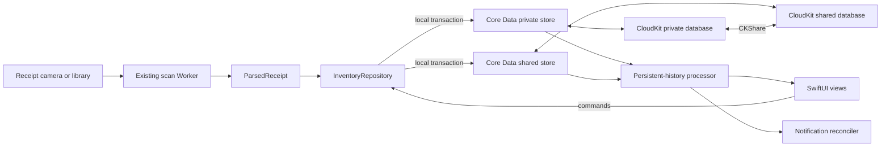

# Household sharing architecture

> Approved design for Tridge's next collaboration subsystem. The implementation state lives in
> [`status.md`](./status.md); this page is the source of truth for how household sharing works once
> built. The v1 visual and interaction contract remains in
> [`design/fridge-design.html`](../design/fridge-design.html).

## Product contract

A **household** is the sharing boundary for the inventory that Tridge presents as one fridge. It
includes items stored in the fridge, freezer, and pantry. The owner can invite other Tridge users to
the household; accepted members see the same inventory and can scan, add, edit, eat, toss, and delete
items. Changes are local-first and converge through iCloud when connectivity returns.

The first release assumes:

- every participant uses Tridge on an Apple device with an active iCloud account;
- invited members are trusted editors, while the share creator is the owner;
- offline use and eventual convergence are required, but hard real-time delivery is not;
- one active household is enough for the first UI, while the data model supports more than one; and
- Android, web access, non-iCloud identities, public share links, and fine-grained roles are out of
  scope.

If Tridge needs cross-platform clients or permissions such as "can add but cannot delete," the
shared inventory moves behind a server-authoritative API. CloudKit's read/write participant role is
intentionally a trusted-household boundary, not an adversarial authorization system.

## System shape

The Cloudflare Worker remains the receipt-processing boundary: it authenticates the installation
with App Attest, sends the JPEG to OpenAI, and returns `ParsedReceipt`. It does not store household
membership or inventory. App Attest proves that a request comes from a genuine Tridge installation;
CloudKit identifies the iCloud user and enforces access to a household share. These are separate
trust decisions and neither substitutes for the other.

## Persistence and sharing

SwiftData continues to describe the v1 implementation, but its managed CloudKit integration mirrors
a user's private database rather than the shared database needed for collaboration. Household
sharing therefore uses `NSPersistentCloudKitContainer`, with the same model loaded into two stores:

- the **private store** contains households owned by the current iCloud user; and
- the **shared store** contains households that other users shared with the current user.

Both store descriptions enable persistent history and remote-change notifications. A single
repository fetches across them and routes new objects to the persistent store that owns their
household, so views never need to distinguish an owned household from a received one.

Each household is the root of one private `CKShare`. Its complete object graph stays in that share's
record zone; relationships never cross household/share boundaries. The owner distributes an
invite-only share URL through Apple's sharing UI and grants accepted participants read/write access.
`CKShare.participants` is the membership source of truth, so Tridge does not maintain a parallel
member table.

The app adds the iCloud/CloudKit and remote-notification capabilities, declares CloudKit sharing
support, and bridges SwiftUI's lifecycle to the application and scene delegate callbacks that accept
a share into the shared persistent store. Sharing is disabled with a clear account-state message
when iCloud is unavailable; the local store remains usable.

## Domain model

The persisted graph has three collaboration concepts:

| Concept | Responsibility |
| --- | --- |
| `Household` | Stable id, display name, creation metadata, and root of the `CKShare` graph. |
| `FridgeItem` | Existing item identity and metadata, plus its household relationship, lifecycle timestamps, and tombstone/deduplication metadata. |
| `StockChange` | Immutable, uniquely identified quantity operation: add/adjust/consume, delta, optional eaten/tossed disposition, and occurrence metadata. |

Device preferences such as notification hour and emoji-free mode remain local and outside the share.
Food Category remains derived from `artKey`, and urgency remains derived from `expiryDate`, preserving
the existing single-source rules in `Tridge/Core/Types.swift` and `Tridge/Core/Urgency.swift`.

`StockChange` is authoritative for quantity-affecting collaboration. A scan or manual restock appends
a positive operation; eating or tossing appends a negative operation. The current quantity and
terminal disposition are a deterministic projection. Immutable operation ids make retries idempotent
and prevent CloudKit's last-writer-wins scalar merge from dropping one of two concurrent increments.
The reducer and conflict rules stay in the Linux-testable `FridgeCore` target.

Scalar metadata edits to name, art, storage, and expiry use last-writer-wins. A tombstone wins over a
stale edit. Two peers can still create same-name items while offline; after import, every peer chooses
the same canonical record by stable UUID ordering, transfers stock once through a deterministic
operation id, marks the other records as duplicates, and deletes them only after a later successful
import/export cycle. This follows CloudKit's eventual-deduplication model rather than relying on a
uniqueness constraint the server cannot enforce.

## Application boundary

Views stop mutating persistence models directly. They read household-scoped snapshots and submit
commands through `InventoryRepository`:

- add or merge reviewed receipt rows;
- add a manually entered item;
- apply an item-details patch;
- eat or toss one unit;
- delete an item; and
- clear the active household's inventory.

Forms edit local drafts and commit once instead of syncing every keystroke. The repository checks
CloudKit update/delete capability, applies `MergePlanner` within the active household, writes the
correct store, and emits the local side effects. The UI updates from the local transaction
immediately; CloudKit export is asynchronous.

The new module boundaries are:

| Component | Responsibility |
| --- | --- |
| Household domain additions in `FridgeCore` | Value types, commands, stock reducer, conflict policy, and deterministic deduplication. |
| `PersistenceController` | Private/shared `NSPersistentCloudKitContainer` stores, contexts, and store routing. |
| `InventoryRepository` | Sole inventory query/command API used by the app's views and scan flow. |
| `HouseholdSession` | Active household, iCloud account state, participant capability, and sync status. |
| `HouseholdSharingService` | Create, fetch, present, manage, leave, and stop a `CKShare`. |
| Share invitation bridge | Application/scene delegate handling that accepts share metadata into the shared store. |
| Persistent-history processor | Consume remote transactions, merge the view context, and trigger convergence work. |
| Notification reconciler | Bring local expiry notifications and the badge in line with imported inventory. |

No third-party package is required.

## Core flows

### Invite and join

The owner opens Household from Settings and chooses Share Fridge. The sharing service creates or
loads the household's `CKShare`, presents Apple's participant UI, and distributes its stable URL.
When a recipient accepts the invitation, the scene delegate passes the metadata to the persistent
container. CloudKit imports the graph into the shared store, `HouseholdSession` selects it, and Home
renders the same repository-backed inventory.

The system sharing UI also owns participant removal and permission display. A participant can leave;
the imported graph then disappears from that participant's shared store. When the owner stops
sharing, Tridge first preserves the owner's graph as a private household before purging the share, so
stopping collaboration never destroys the owner's inventory.

### Local inventory change

Home, manual add, item detail, or scan review sends a household-scoped command. The repository saves
the item metadata and stock operation in one local transaction, then the UI and local notifications
update immediately. `NSPersistentCloudKitContainer` exports the transaction and accepted members
receive it through their shared stores.

### Remote inventory change

A CloudKit notification wakes the container, which imports changes and records them in persistent
history. The history processor merges only transactions newer than each store's saved token, runs
deduplication/projection repair, refreshes the active household, and invokes the notification
reconciler. Foreground activation also checks for completed import/export events so an indeterminate
background schedule never leaves the visible fridge stale indefinitely.

### Receipt scan

The scan path through `ProxyLLMService` and the Worker is unchanged. `ScanFlowModel` keeps only its
camera-to-review responsibility; confirmation converts reviewed rows into repository commands for
the active household instead of writing a model context directly. Household identifiers and CloudKit
credentials never go to the scan Worker.

## Upgrade from the shipping build

The sharing release performs an **automatic inventory reset without requiring an uninstall**. It
opens the Core Data/CloudKit stack at a new explicit store location and does not attach the legacy
SwiftData store. On first launch it creates a fresh personal household and records the new persistence
generation. Existing App Store and TestFlight installations therefore upgrade normally while the old
test inventory becomes inactive.

The reset is deliberately narrow:

- notification hour, emoji-free mode, App Attest registration, and other device preferences survive;
- pending and delivered expiry notifications from the retired inventory are cancelled and the badge
  is cleared once;
- a one-time message explains that the sharing update starts a fresh fridge; and
- the legacy SwiftData files remain untouched for rollback and are not opened or deleted by the
  sharing release.

Leaving the old files in place is safer than destructive file cleanup and small enough for the test
population. A later release may remove only the exact legacy store files after the new persistence
generation has been proven in production. There is no SwiftData-to-Core-Data item migration and no
manual uninstall step.

## Notifications and local state

Each device owns its notification preference and schedules reminders for every active item it can
see. Remote imports reschedule changed expiry dates and cancel reminders for consumed, deleted, or
revoked items without prompting for notification permission. Identifiers include household and item
ids so two households cannot collide. Badge state is recomputed from the active household after every
local save, remote import, foreground transition, and one-time reset.

## Failure and lifecycle behavior

- **Offline:** local commands remain visible and export when CloudKit becomes available.
- **No iCloud account/restricted account:** personal local use continues; sharing actions explain
  that iCloud is required.
- **Read-only or revoked participant:** repository capability checks reject writes; imported data is
  removed when CloudKit ends access.
- **Partial sync failure:** local data remains; sync status is diagnostic and retryable rather than a
  destructive rollback.
- **Account switch:** shared data from the prior account is removed from the active session before the
  new account's stores are presented.
- **Owner stops sharing:** the owner keeps a private copy; participants lose the shared graph.

## Verification contract

Pure stock reduction, idempotency, tombstone precedence, and duplicate selection run under
`swift test` on Linux. Apple-platform integration tests cover repository routing and persistent
history with local stores. CloudKit acceptance uses two distinct iCloud accounts and verifies:

- an App Store/TestFlight upgrade reaches the new empty household without uninstalling;
- preferences and App Attest keep working while old expiry notifications disappear;
- invite, accept, edit, revoke, leave, and stop-sharing lifecycles;
- both peers adding or consuming while offline converge without a lost quantity;
- concurrent same-name creation converges to one item;
- a remote expiry edit reconciles notifications on the other device; and
- a confirmed receipt scan writes only to the selected household.

The CloudKit development schema stays disposable until the model and two-account acceptance pass.
Before a TestFlight/App Store sharing build, the final schema is promoted to CloudKit production;
production schema changes are treated as additive from that point onward.

## Platform references

- [Syncing model data across a person's devices](https://developer.apple.com/documentation/swiftdata/syncing-model-data-across-a-persons-devices)
- [Sharing Core Data objects between iCloud users](https://developer.apple.com/documentation/coredata/sharing-core-data-objects-between-icloud-users)
- [`NSPersistentCloudKitContainer`](https://developer.apple.com/documentation/coredata/nspersistentcloudkitcontainer)
- [`UICloudSharingController`](https://developer.apple.com/documentation/uikit/uicloudsharingcontroller)
- [Accepting share invitations in a SwiftUI app](https://developer.apple.com/documentation/coredata/accepting-share-invitations-in-a-swiftui-app)

The load-bearing choices and rejected alternatives are recorded in
[`decisions.md`](./decisions.md) → *2026-08-06*.
