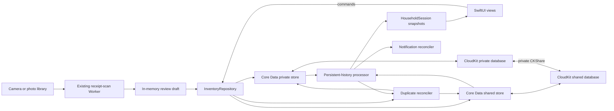

# Household sharing architecture

> Implementation contract for Tridge's household-sharing release. The implementation state lives
> in [`status.md`](./status.md). The existing visual language remains normative in
> [`design/fridge-design.html`](../design/fridge-design.html); this page is normative for the
> persistence, collaboration, Household screen, upgrade, and verification behavior added by the
> sharing release.

## Simple summary

One **household** is one shared fridge, including its fridge, freezer, and pantry items. The person
who starts it owns the CloudKit share. They send an Apple invitation to another Tridge user, and
accepted members can see and edit the same inventory. Tridge saves every change locally first, so it
continues to work without a network connection, then iCloud carries the change to the other devices.

Example: Maya has five apples in "Home." She invites Alex. Alex eats one while offline, while Maya
adds two from a receipt. Their phones immediately show four and seven respectively. After both
phones reconnect, both operations are present and both phones show six. The receipt still goes only
to the existing scan Worker; the shared inventory goes only through the household's CloudKit share.

The existing item-grouping behavior also survives sharing. If Maya and Alex each add one "Milk"
while both are offline and neither can see the other's new row, Tridge preserves both additions but
projects them as one logical Milk with quantity two after synchronization. It links the two physical
histories instead of deleting either one, so an operation arriving late still counts. Each inferred
link captures both items' identity revisions; if Alex had concurrently corrected one item to
"Cream," that stale Milk link becomes inactive and the two histories stay separate. An expired,
zero, or deleted Milk remains a closed batch; a later purchase starts a new one.

Clear All also has an offline-safe rule. If Maya and Alex both clear while offline, neither clear
"wins" by deleting the other's later work. Each clear creates a branch in the household's causal
inventory frontier, so groceries added after either clear remain after synchronization. A later
Clear All performed after both branches are visible replaces both branches and clears their items.

Installed App Store and TestFlight users update normally. The sharing build starts a fresh inventory
in new database files, preserves settings and App Attest, removes obsolete expiry reminders, and
shows one explanation. Nobody must uninstall the old build.

## Closed product decisions

These choices are fixed for the first sharing release; an implementation agent must not invent a
different behavior.

| Question | Decision |
| --- | --- |
| Who can use sharing? | Apple-device users signed in to an active iCloud account. |
| Who can edit? | The owner and every accepted participant. There is no read-only product role. |
| Who can invite? | Only the owner. Public links, access requests, and participant re-invites are disabled. |
| How many fridges? | The UI has one active household at a time. It lists the personal household plus accepted households; there is no Create Household action in this release. |
| Is iCloud optional? | No for the sharing build. A signed-out or restricted account sees an account-required screen; an already validated signed-in session can continue through an ordinary network outage. |
| Is synchronization live? | No hard real-time promise. Local writes are immediate and CloudKit converges eventually. |
| What happens to concurrent quantities? | Immutable stock operations compose; no increment or decrement is overwritten by a scalar last-writer-wins merge. |
| What happens to simultaneous same-name creation? | Exact-name active items converge to one logical item. Tridge retains every physical row and stock event, joins matching identity revisions with immutable merge claims, and sums the histories; a concurrent rename deactivates a stale claim, and Tridge never transfers then deletes a duplicate. |
| What does Clear All mean offline? | It advances a causal household inventory frontier. Items from a superseded frontier stay in history but cannot reappear when an offline device reconnects. Concurrent clear branches coexist, so groceries added after either clear survive; a later clear that has imported both branches supersedes both. |
| What happens when sharing ends? | A participant leaves without a copy. An owner may stop sharing and keep the data already visible on the owner's device, after a warning that another member's unseen offline edits cannot be recovered, or delete the shared fridge for everyone. |
| Is old inventory migrated? | No. Test inventory resets automatically in place. The legacy SwiftData files remain available for rollback during normal use and have a separate explicit local-erasure action. |
| Does this add a runtime dependency? | No package currently fits the account-isolated, two-store event contract. The repository's evidence-based policy still permits a reviewed dependency when one materially reduces risk. |

Cross-platform clients, non-iCloud identities, public shares, adversarial member permissions,
grocery lists, recipes, and a user-facing manual merge tool are out of scope. If Tridge later needs
Android/web or field-level roles, inventory must move behind a server-authoritative API.

## Why this architecture



`NSPersistentCloudKitContainer` is the Apple-supported fit for a managed object graph that needs a
local replica, private-database sync, and CloudKit Sharing. Tridge uses one model in two stores:

- the **private store** contains households owned by the current iCloud user; and
- the **shared store** contains households received from other iCloud users.

Each household is Tridge's **logical aggregate** inside one Core Data zone-wide `CKShare`; it is not
a CloudKit hierarchical-root record. `NSPersistentCloudKitContainer.share([household], to: nil)`
moves the related graph into the share's record zone. Its items and stock operations stay in that
same persistent store and share graph, along with its item-merge links. Relationships never cross
household, store, or share boundaries. `CKShare` is the membership source of truth; Tridge does not
create an account system or a parallel member table.

The scan Worker remains a separate trust boundary. App Attest authorizes a Tridge installation to
use the billed receipt endpoint. CloudKit identifies an iCloud user and authorizes access to a
household. Household ids, share URLs, participant identities, CloudKit credentials, and stored
inventory never go to the Worker.

## Adopt, do not reinvent

Use these platform components directly:

| Need | Adopt | How Tridge uses it |
| --- | --- | --- |
| Local persistence and iCloud mirroring | Core Data + `NSPersistentCloudKitContainer` | One private and one shared SQLite store. |
| Create and distribute an invitation | `CKShare`, `ShareLink`, and `CKShareTransferRepresentation` | Share the Household aggregate into its zone and send the share's stable URL. |
| Restrict invitation choices | `CKAllowedSharingOptions` | Specified recipients and read/write only; access requests and participant invitations remain false. |
| Manage participants | `UICloudSharingController` | Existing system UI, wrapped for SwiftUI. Do not build a contacts or participant editor. |
| Accept invitations | `CKSharingSupported` plus application/scene delegate callbacks | Route metadata to `acceptShareInvitations(from:into:)` for the shared store. |
| Detect remote data | Persistent history and remote-change notifications | Consume a token per store and refresh value snapshots. |
| Present overall sync health | `NSPersistentCloudKitContainer.Event`, `NWPathMonitor`, and the account coordinator | Reduce only events belonging to the current session's loaded store identifiers. |
| Detect share-metadata changes | `CKSystemSharingUIObserver`, container events, and foreground refresh | Share changes do not create persistent-history transactions. |
| Reference implementation | Apple's **CoreDataCloudKitShare** sample attached to its sharing guide | Adapt its two-store, invitation, history, and lifecycle patterns; preserve any copied license headers. |

`SyncStatusProviding` is a main-actor protocol with `currentStatus`, an `AsyncStream<SyncStatus>` of
updates, `prepareSession(generation:)`, `activateSession(generation:storeIdentifiers:)`, and
`endSession(generation:)`. Its domain enum is exactly `.upToDate`, `.syncing`, `.offline`, and
`.needsAttention`. `AccountSessionCoordinator` creates a fresh random generation and calls
`prepareSession` **before** `loadPersistentStores`, then calls `activateSession` with the exact two
loaded store identifiers after both descriptions finish. Ending a session clears every in-flight
or buffered event and subscription owned by that generation.

`StoreScopedSyncMonitor` installs its
`NSPersistentCloudKitContainer.eventChangedNotification` observer during `prepareSession`, before a
store load can start setup/import work. Until activation it buffers event snapshots by
`event.identifier`, retaining their `storeIdentifier`, type, start, and completion. Activation
discards buffered events for every store except the two just loaded, replays the remaining starts
and completions in notification order, and then accepts live starts only for those identifiers. A
completion is accepted only when its start was recorded for the still-current generation and store.
A completion from account A that arrives while account B loads or after B activates is therefore
dropped. Timestamps are diagnostic data, never the isolation boundary. `NWPathMonitor` supplies
reachability; the account coordinator remains authoritative for whether stores may open or writes
may proceed.

Mapping precedence is deterministic: an unavailable/restricted account or a current-session
non-network setup/import/export failure is `.needsAttention`; a validated account with an
unavailable network is `.offline`; any current-session in-progress event or incomplete initial
setup/import is `.syncing`; successful setup and import for both current stores, with exports either
not started or successful, is `.upToDate`. A successful initial private-store import is also the
bootstrap barrier described below; store loading alone is not that barrier. The label is diagnostic
only and never claims that another device has already received a change.

[`CloudKitSyncMonitor` 3.1.0](https://github.com/ggruen/CloudKitSyncMonitor/blob/3.1.0/Sources/CloudKitSyncMonitor/SyncMonitor.swift)
was evaluated but is not adopted. Its process-wide reducer copies type/timestamps/result from
`NSPersistentCloudKitContainer.Event` and drops `storeIdentifier`, so an adapter cannot prove that a
published completion belongs to the active account's stores. Using it only for reachability and
account status would not justify a runtime dependency. The other alternatives were evaluated, not
rejected merely because they are dependencies:

- Apple's [`sample-cloudkit-sharing`](https://github.com/apple/sample-cloudkit-sharing) is a useful
  MIT-licensed raw-CloudKit reference, but it is not a Core Data sharing library.
- [`SyncKit`](https://github.com/mentrena/SyncKit) owns CloudKit record synchronization itself and
  would compete with `NSPersistentCloudKitContainer`; it is not a sharing-lifecycle wrapper.
- [`Automerge`](https://github.com/automerge/automerge-swift) is a full CRDT document model. Adding
  a second persistence/conflict system beside Core Data and CloudKit would increase, not remove, the
  work. Tridge needs immutable stock events, inventory epochs, and revision-guarded merge claims.

Future dependencies are allowed when a decision entry records the concrete gap, alternatives,
license, maintenance/security/privacy posture, exact version policy, and replacement boundary. A
package is not justified solely by reducing a few lines of domain-specific code.

## Apple project and service configuration

The identifiers and capabilities are part of the contract:

- bundle identifier: `com.tridge.app` (unchanged, so installed builds update in place);
- CloudKit container: `iCloud.com.tridge.app`;
- add `Tridge/Tridge.entitlements` and set `CODE_SIGN_ENTITLEMENTS` for Debug and Release;
- enable iCloud with CloudKit for the container, Push Notifications, and Background Modes → Remote
  notifications;
- add `CKSharingSupported = YES` and `UIBackgroundModes = [remote-notification]` to the generated
  app Info.plist settings; and
- keep automatic signing. Debug/dev-signed builds use the CloudKit development environment;
  TestFlight/App Store builds use production.

The entitlements file contains the iCloud container identifiers/services and the ubiquity key-value
store identifier generated for the existing team. Xcode/provisioning supplies the appropriate APS
environment; do not hardcode a production push value into Debug.

Only the Apple Developer account owner can create/associate the iCloud container, enable the App ID
services, and promote a production schema. Those prerequisites are listed in
[Owner handoff](#owner-handoff). They do not block pure logic, repository, UI, or local-store work.

## Persistence contract

### Store setup

Add `Tridge/Persistence/TridgeModel.xcdatamodeld` and load it with
`NSPersistentCloudKitContainer(name: "TridgeModel")`. After CloudKit reports an available account,
fetch the current container-specific user record id, hash its record name with SHA-256, and use only
that nonlogged hash as the local account scope. Use explicit new URLs:

```text
Application Support/HouseholdSharing/Accounts/<account-scope-hash>/private.sqlite
Application Support/HouseholdSharing/Accounts/<account-scope-hash>/shared.sqlite
```

Never persist or log the raw CloudKit user record id. Persist the last successfully validated hash
only so a running, already validated session can survive an ordinary network outage. On a cold
launch, do not expose a cached account's inventory until the current account identity is validated;
if identity cannot be checked yet, show a retrying account state. Active-household ids, history
tokens, notification prefixes, sharing-transition state, and store paths are scoped by this hash.
The upgrade's persistence, legacy-side-effect-cleanup, reset-notice acknowledgement, and legacy-store
erasure markers are installation-wide because they describe this installation rather than an iCloud
account.

Both descriptions use the same model and `iCloud.com.tridge.app`. Set their CloudKit database scopes
to `.private` and `.shared` respectively. Both enable:

- `NSPersistentHistoryTrackingKey`;
- `NSPersistentStoreRemoteChangeNotificationPostOptionKey`;
- automatic/inferred lightweight migration for additive development changes; and
- `NSPersistentStoreFileProtectionKey = completeUntilFirstUserAuthentication`, so background
  imports can run after the first unlock without leaving the files unprotected.

The stack is ready only after **both** stores load. Do not `fatalError` on failure. `LaunchState`
shows loading, iCloud-account-required, or a retryable persistence error until a complete stack is
available. A partial private-only stack is not exposed to the UI because commands could be routed to
the wrong store.

Use a main-queue, read-only view context with `automaticallyMergesChangesFromParent = true` and a
store-trump merge policy. Repository writers use serial private-queue contexts, the transaction
author `app.inventory`, and an object-trump merge policy. Duplicate reconciliation uses a separate
serial context with author `app.reconcile`. No managed object crosses a context or is stored in
SwiftUI state; pass `NSManagedObjectID` internally and value snapshots across module boundaries.

For every inserted Household, FridgeItem, StockChange, ItemMerge, and HouseholdClear, the repository
calls `context.assign(_:to:)` for the household's resolved store before save. A participant-created
child must be assigned to the shared store explicitly. A relationship to an object in another store
is a programming error and fails the command before save.

Derive `Owned by you` from the Household object's persistent store (`.private`) and `Shared with you`
from `.shared`; do not infer ownership from optional participant identity fields. Fetch the
Household's `CKShare` only for share status, capabilities, invitation, and lifecycle actions.

### Exact Core Data model

Core Data class names carry a `Record` suffix so they cannot be confused with the public value
snapshots. Every persisted attribute is optional in the model and validated/filled by repository
initializers, satisfying CloudKit model rules without leaking optionals into the domain. Relationships
are optional, unordered, and have inverses. There are no unique constraints, ordered relationships,
transformable values, or `Deny` delete rules.

Use one model configuration for both store descriptions; do not split related entities across Core
Data configurations. Set each entity's Codegen to Manual/None and module to Current Product Module,
then keep the hand-written `*Record` subclasses in `Persistence/ManagedObjects` so validation and
tests compile predictably on every Xcode version.

| Entity | Attributes | Relationships |
| --- | --- | --- |
| `HouseholdRecord` | `id: UUID`, `modelVersion: Int16` (starts at `1`), `name: String`, `initialInventoryEpochID: UUID`, `createdAt: Date`, `modifiedAt: Date` | `items` → many `FridgeItemRecord`, inverse `household`, Cascade; `itemMerges` → many `ItemMergeRecord`, inverse `household`, Cascade; `clearEvents` → many `HouseholdClearRecord`, inverse `household`, Cascade |
| `FridgeItemRecord` | `id: UUID`, `modelVersion: Int16` (starts at `1`), `name: String`, `normalizedName: String`, `identityRevisionID: UUID`, `inventoryEpochContextRaw: String`, `artKey: String`, `storageRaw: String`, `purchaseDate: Date`, `expiryDate: Date`, `expirySourceRaw: String`, `createdAt: Date`, `modifiedAt: Date` | `household` → one `HouseholdRecord`, inverse `items`, Nullify; `stockChanges` → many `StockChangeRecord`, inverse `item`, Cascade |
| `StockChangeRecord` | `id: UUID`, `modelVersion: Int16` (starts at `1`), `delta: Int64`, `reasonRaw: String`, `occurredAt: Date` | `item` → one `FridgeItemRecord`, inverse `stockChanges`, Nullify |
| `ItemMergeRecord` | `id: UUID`, `modelVersion: Int16` (starts at `1`), `leftItemID: UUID`, `leftIdentityRevisionID: UUID`, `rightItemID: UUID`, `rightIdentityRevisionID: UUID`, `createdAt: Date` | `household` → one `HouseholdRecord`, inverse `itemMerges`, Nullify |
| `HouseholdClearRecord` | `id: UUID`, `modelVersion: Int16` (starts at `1`), `epochID: UUID`, `parentEpochIDsRaw: String`, `revision: Int64`, `occurredAt: Date` | `household` → one `HouseholdRecord`, inverse `clearEvents`, Nullify |

`ItemMergeRecord` is an immutable, revision-guarded identity claim. Its endpoint ids are different,
sorted by UUID byte order (`leftItemID < rightItemID`), and must resolve to items in the same
household and persistent store whose inventory contexts are both active in the current frontier.
The two contexts need not be identical: items added after two concurrent clears may still converge
by name. The captured revision beside each endpoint must equal that item's current
`identityRevisionID`, and the current normalized names must still match, for the claim to
participate in projection. A revision or active-context mismatch is an expected dormant claim, not
corruption. Duplicate claims for the same endpoints and revisions are valid and have the same union
effect, which makes concurrent reconciliation idempotent without a CloudKit-incompatible uniqueness
constraint.

`HouseholdClearRecord` is an immutable edge in a causal epoch graph. The initial node is revision
`0` with `HouseholdRecord.initialInventoryEpochID`. `parentEpochIDsRaw` and
`FridgeItemRecord.inventoryEpochContextRaw` are the same canonical encoding: a JSON array of
lowercase UUID strings, sorted by UUID byte order, unique, and nonempty. A Clear All captures the
entire current frontier as its parent set, creates a fresh `epochID`, and sets `revision` to one plus
the greatest parent revision. The current frontier is every reachable epoch with no outgoing valid
clear edge; the initial epoch is the frontier before the first clear.

Two offline clears from the same frontier therefore create two leaf epochs instead of a winner and
loser. Their records reduce in any order to a frontier containing both leaves. An item captures the
device's entire visible frontier when it is created and is current exactly when every captured epoch
is still in the reduced frontier. Thus an item added after either concurrent clear stays current
after the branches meet, while an item created before those clears does not. A later Clear All that
has imported both leaves lists both as parents and replaces them with one new leaf. A clear created
on a device that has seen only one branch supersedes only that branch; this is the causal boundary,
not wall-clock time or UUID ordering.

The Linux reducer topologically validates parents against the initial epoch or another valid clear
record and requires `revision == max(parent revisions) + 1`. Import order does not matter: a child
whose parent has not arrived is pending for that reduction and is reconsidered after every relevant
history batch. A permanently missing parent, noncanonical/empty context, repeated epoch id with a
conflicting payload, cycle, nonpositive revision, or overflow is corrupt and cannot suppress valid
inventory. Duplicate records with the same id and payload reduce once.

Set local nonunique fetch indexes on `FridgeItemRecord.normalizedName`, each ItemMerge endpoint, and
`HouseholdClearRecord.revision`. Epoch contexts are reduced per household and are not used as an
exact-string query index.

`receiptText`, receipt images, `quantity`, `status`, `consumedDate`, a mutable deletion flag,
urgency, and Food Category are **not** persisted:

- raw receipt text exists only in the in-memory review draft and is discarded after confirmation;
- quantity and consumption history derive from StockChange records;
- active/inactive status and deletion derive from immutable StockChange events;
- urgency derives from `expiryDate`; and
- Food Category derives from `artKey` through `ItemID.foodCategory`.

Before initializing the development schema, set `allowsCloudEncryption = true` on the user-content
attributes: household name; item name, normalized name, art key, storage, purchase/expiry dates, and
expiry source; stock delta, reason, and occurrence date; and the clear occurrence date. Leave ids,
identity/epoch revisions, Lamport counters, and bookkeeping timestamps unencrypted, including
ItemMerge endpoint ids. This decision must exist before production promotion because CloudKit field
encryption cannot be toggled casually after a field ships.

The repository treats a missing required value, invalid raw enum, nonfinite date, empty normalized
name, a normalized name different from applying `NameKey` to the current name, a delta invalid for
its reason (including zero for a nonterminal reason), or a broken relationship as corrupt imported
data. An invalid/self/cross-household ItemMerge endpoint is corrupt too; a well-formed claim whose
captured identity revision is merely stale is ignored instead. It excludes corrupt records from the
UI, logs only entity/id/error category, and leaves them intact for diagnostics; it never logs the
household or item content.

## Inventory semantics

### Stock operations

`StockChange` is immutable after insertion. Its reasons are:

| Reason | Valid delta |
| --- | --- |
| `acquired` | positive; initial manual/scan add or merge/restock |
| `adjusted` | any nonzero value; committing the quantity field |
| `eaten` | exactly `-1` |
| `tossed` | exactly `-1` |
| `preserved` | positive; active inventory copied when an owner stops sharing |
| `deleted` | exactly `0`; immutable user deletion marker |
| `cleared` | exactly `0`; immutable Clear All marker |

For one logical item, the reducer collects StockChange records from every physical item connected by
revision-valid ItemMerge claims, keeps one canonical operation per `id` across that whole set, then
computes:

```text
rawQuantity = sum(canonical deltas)
quantity    = max(0, rawQuantity)
isDeleted   = any canonical reason is deleted or cleared
```

Command ids are generated before a write and reused if that command is retried; the StockChange id
is that command id. A repeated id with the same payload therefore applies once. If corrupt records
reuse an id with different payloads, the Linux-testable reducer deterministically selects the
lexicographically smallest `(occurredAt, delta, reasonRaw)` tuple and emits an integrity diagnostic.
Sum with `addingReportingOverflow`; an overflow marks that item corrupt and excludes it from the UI
instead of trapping or wrapping. Repository-created operations cannot approach that limit.

Inputs from a scan, manual add, or an individual quantity edit remain `1...99`. Concurrent positive
operations can legitimately make the synchronized result exceed 99; display the real count rather
than dropping stock. A detail draft that begins above 99 remains unchanged unless the user edits it;
a new typed target is still clamped to `1...99`.

The quantity field commits one `adjusted` operation with `target - currentLocalProjection`. Remote
operations that were not yet visible still compose later, so the final synchronized value may differ
from the target. Two peers consuming the last visible unit can produce a negative raw sum, but the UI
shows zero. Once an item projects to zero, later purchases create a new item rather than paying down
the old operation history. No operation log is compacted or pruned in this release.

The projector first discards physical members whose captured inventory context is not a subset of
the household's current frontier, then applies revision-valid merge claims among the remaining
members. A resulting item group is visible/active only when `isDeleted == false` and projected
quantity is greater than zero. Delete never removes records or merge claims. It appends the same
immutable `deleted` StockChange id/payload to every physical member in the current revision-valid
group; the grouped reducer counts that id once, while every member remains terminal if a later
frontier or identity change makes a claim dormant. A terminal event on any member closes the current
group, so stock or nonidentity metadata changes that arrive later cannot resurrect it. A previously
unseen, unlinked row is not retroactively deleted without causal evidence. Clear All uses the
stronger household barrier below. A new purchase after deletion or zero creates a new item record
stamped with the complete current frontier.

Clear All is both a per-visible-group terminal command and a household-wide causal barrier. In one
transaction it inserts a preallocated `HouseholdClearRecord` whose parents are the complete current
frontier and appends one preallocated `cleared` StockChange id/payload across every physical member
of each currently visible logical group. The reducer counts each group id once while every known
member is terminal independently. Projection, matching, and commands then use the new leaf. An item
created before that clear, including one not yet imported, has a superseded context: its history
remains exportable but it cannot reappear. An item added concurrently from the parent context may
appear locally and then disappear when the clear arrives, preserving the release's clear-wins rule
for concurrent add versus clear.

Concurrent clears are different because each creates a child of the same parent frontier. Both
children remain leaves after synchronization, so items created after either clear remain visible.
When a later device has imported both leaves, its next Clear All names both as parents and
supersedes both branches. Retrying one command reuses the clear-record, epoch, and StockChange ids;
concurrent commands keep their distinct ids and converge without a tie-break winner.

### Matching and lossless same-item convergence

Keep the current `MergePlanner` behavior, scoped to the active household: exact normalized-name
matches only, never merge into expired, zero-quantity, or deleted items, and choose the newest
eligible purchase if local data already contains more than one match. A merge appends `acquired`
stock to the resolved logical group; it does not insert a second root, create an unnecessary merge
claim, or rewrite a scalar quantity.

That same behavior applies when peers create before they can see one another. Physical
`FridgeItemRecord` rows are durable operation-history anchors; `ItemMergeRecord` is an add-only,
revision-guarded claim that two current identities represent the same logical item. The
Linux-testable `ItemGroupReducer` first rejects dormant claims, then computes connected components
with a union-find reduction. Claim order and duplicate claims do not matter. The logical item id is
the smallest member UUID by byte order, so every peer chooses the same identity.

After every local inventory save and relevant remote-history import, `DuplicateReconciler` examines
the current logical groups in that household and current inventory frontier. It links two groups
when both contexts are current, both groups are active, nonzero, unexpired, and have the same
nonempty normalized name. It writes a star
from the lowest logical item id to each other group using a serial maintenance context and
transaction author `app.reconcile`. Each claim captures the current `identityRevisionID` beside both
endpoint ids. Immediately before save, the writer refetches the endpoints and verifies the epoch,
eligibility, normalized name, and captured revisions. If two peers still insert the same claim
concurrently, duplicates remain harmless. The snapshot projector applies the same revision-checked
eligible union in memory immediately, so the UI never needs to flash duplicate rows while durable
claims export. Eligibility uses one injected `now`/Calendar snapshot and the same end-of-expiry-day
rule as `UrgencyLogic`; time advancing alone does not deactivate a claim.

Reconciliation never copies StockChange records, rewrites their item relationship, or deletes a
physical FridgeItem. Quantity is the sum of the unique operations across every member. Therefore a
late operation written by an offline peer to either original Milk still appears in the one logical
Milk. A sequential second add and two simultaneous offline adds have the same visible outcome.

For a linked group, metadata comes from the member with the greatest
`(modifiedAt, purchaseDate, createdAt, id)` tuple, using UUID byte order for the final tie. Stock-only
commands do not change `modifiedAt`. An art/storage/expiry edit updates the current winning member
once and sets `modifiedAt` to the later of `now` or the next representable Date after the current
group's maximum, so the edit wins over every revision already visible to that device.

A name edit has identity semantics. If normalization is unchanged, it follows the scalar metadata
rule. If normalization changes, the repository resolves the current connected component, assigns
the command's preallocated `identityRevisionID` plus the new name/normalized name to every currently
known member, advances each `modifiedAt`, and inserts a replacement star of merge claims capturing
that shared revision in the same transaction. This intentionally renames the one logical row without
splitting it. By contrast, if an offline peer renames a physical root before learning about an
inferred claim, that root's new identity revision does not match the claim: the claim becomes
dormant, Milk and Cream project separately, and neither history is moved or deleted. A later exact-
name edit may make the groups eligible for a fresh claim. Concurrent unseen scalar edits still
resolve to one complete metadata winner—Tridge does not pretend to field-merge different art,
storage, or expiry choices.

Commands and stale sheets may address the logical id or any member id; the repository resolves the
current revision-valid component inside its writer context and verifies every member's inventory
context against the freshly reduced frontier.
Adds/eat/toss/adjust append their operation to the lowest-id member. Delete appends its one stable
terminal id/payload to **every** member resolved in that writer transaction, matching the fan-out
rule above; a retry fills any missing member marker and treats identical existing markers as
success. Clear All uses the household frontier barrier above. A previously unseen, unlinked
same-name row that arrives only after an individual Delete is treated as a new batch rather than
destroyed: the system has no causal evidence that it predates that item-specific deletion. Clear All
is different because its explicit causal barrier suppresses every superseded context.

Expired, zero, terminal, inactive-context, and superseded-context groups are never auto-linked to
active groups, and groups with different normalized names are ineligible. Two different contexts
that are both subsets of the current concurrent frontier **are** eligible, so Milk added after each
of two offline clears still converges to one logical Milk. This preserves the shipping rule that
buying Milk after the old Milk expires or reaches zero creates a fresh batch with its own expiry and
history. ItemMerge claim records remain until the household is deleted, but stale claims are
dormant. There is no user-facing manual split/unmerge operation in this release.

CloudKit's normal conflict resolution applies to concurrent edits of name, art, storage, and expiry:
one value wins per physical member before the deterministic group-level metadata selection above.
Forms use value drafts and commit once, so typing does not export every keystroke.

## Application boundaries and modules

SwiftUI stops importing SwiftData and stops mutating persistence objects. It reads snapshots from a
main-actor `HouseholdSession` and sends commands through `InventoryRepository`.

```text
Tridge/
├─ Core/
│  ├─ InventoryCommands.swift       value commands/errors
│  ├─ InventorySnapshots.swift      HouseholdSnapshot + InventoryItemSnapshot
│  ├─ StockReducer.swift            order-independent quantity/idempotency rules
│  ├─ ItemGroupReducer.swift        revision-guarded claim union + deterministic projection
│  ├─ InventoryEpochReducer.swift   causal frontier codec + Clear All graph reduction
│  ├─ HouseholdSelection.swift      deterministic active-household fallback
│  └─ NotificationPlan.swift        pure desired-vs-scheduled reminder diff
├─ Persistence/
│  ├─ TridgeModel.xcdatamodeld
│  ├─ ManagedObjects/               *Record classes and validated mapping
│  ├─ PersistenceController.swift   two stores, contexts, store lookup
│  ├─ CoreDataInventoryRepository.swift
│  ├─ DuplicateReconciler.swift     creates revision-guarded exact-name claims
│  ├─ PersistentHistoryProcessor.swift
│  └─ HistoryTokenStore.swift
├─ Sharing/
│  ├─ HouseholdSharingService.swift CKShare create/fetch/manage/leave/stop
│  ├─ HouseholdShareItem.swift      Transferable used by ShareLink
│  ├─ ShareInvitationRouter.swift   buffers cold/warm invitation metadata
│  ├─ PendingInvitationStore.swift  durable account/zone-scoped selection intent
│  ├─ AppDelegate.swift             scene configuration + account events
│  ├─ SceneDelegate.swift           CloudKit invitation callbacks
│  └─ StoreScopedSyncMonitor.swift  current-store events → Tridge sync state
├─ App/
│  ├─ AccountSessionCoordinator.swift account validation, monitor/store startup, bootstrap gate
│  ├─ AccountTaskRegistry.swift     generation-bound task admission + cancel/drain
│  ├─ HouseholdSession.swift        active id, snapshots, capabilities, UI state
│  └─ LaunchState.swift             loading/account/error/reset-notice states
├─ Services/
│  └─ NotificationService.swift     reconciles active-household reminders
└─ Views/Household/
   ├─ HouseholdScreen.swift
   └─ CloudSharingController.swift  UICloudSharingController bridge
```

The existing synchronized Xcode folder group picks up these files without per-file project edits.
`Package.swift` already compiles all of `Tridge/Core`, so stock/grouping, selection, command, and
notification logic remains Linux-testable. Core Data, CloudKit, Network, UIKit, and SwiftUI stay
outside `FridgeCore`.

The component responsibilities are intentionally narrow:

| Component | Sole responsibility |
| --- | --- |
| `PersistenceController` | Construct both stores, identify each loaded store/scope, create confined contexts, and report complete/failed launch. |
| `AccountSessionCoordinator` | Validate/hash the iCloud account, prepare sync observation before store load, activate it with loaded identifiers, wait for initial private import when required, and invalidate/drain the whole generation on account change. |
| `AccountTaskRegistry` | Admit setup/store-load/repository/history/sharing/reminder tasks only for the current generation, cancel cooperative work, await every registered task before store teardown, and reject late results. |
| `InventoryRepository` protocol | Async household queries and commands; no CloudKit presentation or SwiftUI. |
| `CoreDataInventoryRepository` | Validate commands, resolve the household/store, check capability, assign inserted objects, save atomically, and return snapshots. |
| `HouseholdSession` | Main-actor observable UI state: available/active households, active items, account/capability/sync state, and command errors. |
| `HouseholdSharingService` | Share APIs and owner/participant lifecycle; depends on a protocol so UI/lifecycle tests can use a fake. |
| `ShareInvitationRouter` | Persist provisional then account/zone-scoped selection intent before acceptance, buffer metadata received before dependency setup, and serialize acceptance into the shared store. |
| `PendingInvitationStore` | Atomically persist provisional delivery records and bound container/zone/account selection intent without saving a share URL or participant identity; clear only the matching marker after selection or explicit discard. |
| `DuplicateReconciler` | Persist immutable exact-name links after local saves/imports; never transfer or delete item histories. |
| `PersistentHistoryProcessor` | Consume one history stream per store, run reconciliation, merge changes, refresh snapshots/reminders, then persist the token. |
| `StoreScopedSyncMonitor` | Buffer setup/import events during store loading, then reduce only current-generation events for the two activated store identifiers plus reachability into Tridge sync state; it does not authorize account/store access. |
| `NotificationService` | Diff desired active-household reminders against Tridge-owned pending identifiers, remove pending and delivered alerts for obsolete account/household scopes, and update badge. |

Every loaded-store async call carries an immutable `AccountSessionContext` containing the random
generation, account-scope hash, and both loaded store identifiers; pre-load work carries the
`AccountGenerationContext` defined below. Repository commands, persistent-history work, duplicate
reconciliation, share/lifecycle operations, and reminder refreshes register with
`AccountTaskRegistry` before touching a context. `HouseholdSession` accepts a snapshot, error, or
sync update only when its generation still equals the coordinator's current generation. This check
occurs at the main-actor apply boundary even for work that was already running when an account
notification arrived.

The coordinator creates an immutable `AccountGenerationContext` (random generation + account-scope
hash) immediately after account validation and before constructing/loading stores. After both stores
load, it derives `AccountSessionContext` by adding their identifiers. Implement
`AccountTaskRegistry` as an actor with `run(generation:operation:)` for pre-load work and
`run(context:operation:)` for loaded-store work. Each entry point compares the supplied generation
to the open generation, creates and records the child task **before** starting its operation, and
removes it only after the operation actually returns. Call sites do not launch unregistered account-
bound `Task` work. Its transition operation atomically closes admission and invalidates the
generation, cancels every recorded child, then awaits every child value; cancellation never counts
as completion while a wrapped `context.perform` body is still executing.

The dual `loadPersistentStores` call itself runs as one registered generation task that completes
only after callbacks for both descriptions arrive. A callback captures its generation, never
activates a stale session, and records any successfully loaded store for later removal. If an
account change arrives after zero or one load callback, invalidation closes activation, drain waits
for both callbacks, teardown removes every store loaded for that old generation, and only then may
the next account construct/load its container.

An account transition invalidates the generation and closes task admission first, closes inventory
UI, and clears visible snapshots. The registry then cancels cooperative tasks and **awaits every
registered operation**, including a noncancelable `context.perform` already saving to the old store.
Only after the registry drains does the coordinator end sync observation, remove/release the old
stores and contexts, validate the new account, and prepare its generation. A write already committed
to account A may remain in A's isolated store, but no A result can apply to account B and no task can
touch a removed persistent store.

Repository commands are `addReviewedRows`, `addManualItem`, `updateItem`, `eatOne`, `tossOne`,
`deleteItem`, `clearActiveHousehold`, and `renameOwnedHousehold`. Each includes the household id and a
stable command id. The repository refetches the target inside its writer context and checks
`canUpdateRecord`, `canDeleteRecord`, or `canModifyManagedObjects(in:)` immediately before mutation.
These checks improve the error shown by the UI; CloudKit remains the authorization authority.

Every operation-producing command also carries preallocated ids for every object it may insert:

- manual add has one candidate item id and one StockChange id;
- reviewed rows have a stable candidate item id and StockChange id per row;
- a normalized-name update has one identity-revision id plus replacement ItemMerge ids;
  update/eat/toss commands have one StockChange id, and delete fans its one terminal id/payload out
  to every current physical member;
- Clear All has one clear-record id, one epoch id, and a StockChange id per logical item group in the
  transaction; each group id/payload is fanned out to that group's current physical members; and
- copy-before-purge preallocates its destination household id before recording the transition.

Duplicate reconciliation is an internal maintenance operation, not a user command. It preallocates
an ItemMerge id for each missing sorted endpoint/revision claim, refetches the pair inside its writer
context, and saves every still-eligible claim for one household atomically. A retry or concurrent
duplicate claim has the same union result.

Allocate these values before entering `context.perform` and retain them for an in-process retry. A
retry first fetches the StockChange id in the target household: an identical existing event means
that part already succeeded; a conflicting payload is an integrity error. If a reviewed row now
merges into an existing item, its candidate item id is unused but its StockChange id remains stable.
The multirow add, logical name edit, and Clear All save atomically, so a crash cannot leave a
half-applied command.

Delete is the fan-out exception to that singular retry shortcut. Each attempt resolves the complete
revision-valid physical member set in its writer transaction, fetches **all** StockChange rows with
the command id, and verifies an identical `deleted` payload exists on every resolved member. It
inserts the marker for each missing member in the same save, treats duplicate identical rows as
success, and rejects any conflicting payload. Finding the id on only one member never completes the
retry.

## UI contract

The Home screen keeps its existing title, grid, search, filters, and single bottom add button. It
does not gain a sync banner, account avatar, or tab bar. All existing inventory actions target the
active household supplied by `HouseholdSession`, and it renders one row per projected logical item,
not one row per physical FridgeItemRecord.

Settings adds one first row to its existing everyday section:

```text
🏠  Household                         Home  ›
🔔  Expiry reminder                  9 AM
🔤  Emoji-free mode                    on
📋  Copy diagnostics
```

`Clear all items…` keeps its separate destructive section. Its confirmation says, "This clears the
current inventory in Home for everyone. Items added on an offline device before it receives this
clear will also disappear when that device syncs." It advances the household inventory frontier and
appends immutable `cleared` events to the visible logical groups; specifically, it replaces the
currently observed frontier with one causal child. It is an inventory action, not a privacy-data
erasure action.

The Household row opens `HouseholdScreen`:

- **Your fridges** lists every valid household with name, `Owned by you` or `Shared with you`, its
  creation date, and a checkmark on the active one. Tapping a row selects it locally and refreshes
  Home, reminders, and badge. Selection does not sync to another device.
- An accepted invitation becomes active automatically on the accepting device once its Household
  record imports. The prior personal household remains selectable.
- Every accessible household offers Export Fridge Data….
- The active owner's actions are Rename; Share Fridge… when unshared or Send Invite… when shared;
  Manage Sharing… when shared; Stop Sharing & Keep My Fridge… when shared; Delete Fridge… when
  unshared; and Delete Shared Fridge for Everyone… when shared.
- An upgraded installation whose archived SwiftData store still exists also shows Erase Old Local
  Inventory… in a separate data-controls section. It is device-local and does not delete a current
  household or any CloudKit record.
- A participant sees Manage Sharing… and Leave Household…; participants do not see Rename, Invite,
  Stop, or Delete.
- The screen shows a text-plus-symbol sync state (`Up to date`, `Syncing…`, `Offline — changes will
  sync later`, or `iCloud needs attention`). It never exposes raw CloudKit errors, share URLs, or
  participant identity in diagnostics.
- Loading and destructive actions disable inventory commands and cannot be started twice.

Share Fridge/Send Invite uses `ShareLink` with a `HouseholdShareItem`. The share has title equal to
the household name and a Tridge share type. Its `CKAllowedSharingOptions` permits only specified
recipients and read/write access; both `allowsAccessRequests` and
`allowsParticipantsToInviteOthers` remain false. `publicPermission` is `.none`.

Manage Sharing presents `UICloudSharingController` for the existing share so Apple owns participant
selection/removal and permission display. Tridge does not render a custom member list because
identity fields may be unavailable and a custom list would duplicate system behavior. The wrapper
sets `availablePermissions = [.allowPrivate, .allowReadWrite]` on **every** controller created for an
existing share; `CKAllowedSharingOptions` on `ShareLink` does not configure this separate UI. This
removes public and read-only choices from the management controller as well as from invitation
creation. Before presentation, retain the existing share zone id and Household managed-object id in
the service. If the controller delegate reports that the owner stopped sharing, feed those
identifiers into the same resumable copy-before-purge state machine; do not implement a second stop
path.

Export Fridge Data writes a temporary, versioned JSON document containing export date, household
name, each logical item's projected metadata/current quantity, every physical member record, every
ItemMerge claim, every household clear/epoch record, and complete stock-event history—including
zero, deleted, cleared, dormant-claim, and superseded-context rows. It excludes participant/share metadata,
account ids, diagnostics, receipt text, and receipt images, then presents the system share sheet. Delete
Fridge physically removes an unshared private graph. Delete Shared Fridge for Everyone purges the
shared zone without making the owner copy and explains that every participant loses the data. A
participant's Leave action explicitly says the owner retains the shared data.

Every new control has an accessibility label/identifier, supports Dynamic Type, and communicates
state with text in addition to color. Stop, leave, delete, and clear require explicit confirmation.

## Bootstrap and active-household selection

`loadPersistentStores` completion means the local replicas opened; it does not mean the first
CloudKit import finished. `AccountSessionCoordinator` activates the prepared sync session after both
stores load and waits for the current generation's successful private-store setup and initial
import before it may use the empty-store fallback below. Only then does it merge imported history,
run DuplicateReconciler once for every valid household in both stores, build projections, and run
selection:

1. If a durable invitation-selection marker (`received`, `accepting`, or `awaitingImport`) is bound
   to the current account scope and matches an imported Household zone, select that household,
   persist its UUID, then clear the marker. Unbound and other-account markers are inert.
2. Otherwise, use the locally saved `activeHouseholdID` if it still resolves to an accessible
   household.
3. Otherwise, choose the oldest owned household; break ties by UUID.
4. Otherwise, choose the oldest received household; break ties by UUID.
5. Otherwise, create `My Fridge` in the private store and select it.

Persist only the UUID in `UserDefaults`; validate it every launch. If a selected household is left,
revoked, purged, or deleted, run the same fallback immediately and reconcile reminders.

Persist `initialPrivateImportSucceeded` by account scope and private-store identifier only after the
monitor accepts that successful current-generation import. A new/empty account-scoped cache with no
such marker never creates `My Fridge` while setup/import is pending, offline, or failed; it stays in
a retryable "Finishing iCloud setup…" launch state. Once the barrier succeeds, an empty private
store is evidence for step 5. Existing nonempty validated caches and explicit post-delete fallback
do not wait for a fresh import merely to render local data. This gate prevents an ordinary fresh
installation from creating a duplicate household while its existing cloud household is still
importing.

CloudKit cannot enforce a unique personal-household root. If two truly fresh devices both complete
their initial empty import and then bootstrap before either export reaches the other, both `My
Fridge` records remain and appear in the list with creation dates. Do not silently merge them. The
owner can rename either and delete an unshared extra. The import barrier prevents the routine
fresh-cache duplicate; this remaining simultaneous-device race is explicit and safer than moving a
possibly shared object graph between record zones.

## Sharing and lifecycle flows

### Create and invite

1. Resolve the active owned Household record in the private store and save any pending writes.
2. Fetch its existing share. If absent, call `NSPersistentCloudKitContainer.share([household],
   to: nil)`, configure title/type/private read-write options, and persist the returned share.
   If a share already exists, compare its title to the current household name. A rename saves the
   Household first, then updates `CKShare.SystemFieldKey.title` and calls
   `persistUpdatedShare(_:in:)`; a failed metadata write leaves an account-scoped retry marker.
3. Before every Send Invite, refresh the share, persist the current household title if needed, and
   require that write to succeed before presenting `ShareLink`. Thus a reused invitation never
   knowingly displays a stale fridge name. Canceling the share sheet does not delete the share or
   household; a later Send Invite reuses it.
4. Use `CKSystemSharingUIObserver`/share refetch to update owner/shared state because share metadata
   does not appear in persistent history.

### Accept

Both warm and cold SwiftUI launches must be handled. `SceneDelegate` receives
`CKShare.Metadata`. `ShareInvitationRouter` first verifies the container identifier, then writes a
`PendingInvitationStore` record **before** invoking
`acceptShareInvitations(from:into:)`. A bound record is keyed by container id + share zone id +
account-scope hash; before account validation, a record instead has a fresh provisional delivery id
plus its container/zone. The record also contains its received date and phase `received`,
`accepting`, or `awaitingImport`, but never the share URL or participant identity. If persistence is
not ready, the metadata stays in memory while the durable provisional selection intent already
exists. Acceptance is serialized into the shared store and phase changes are persisted before
publishing in-memory success.

`PendingInvitationStore` is a small actor-backed Codable file at
`Application Support/HouseholdSharing/pending-invitations.json`, outside either account's Core Data
stores because it must work before those stores load. Writes use atomic replacement and
`completeUntilFirstUserAuthentication` protection. If account identity is unavailable, persist an
unbound `received` marker under that delivery id but wait to accept. Within that same live metadata-
handling attempt, after account validation, atomically rekey it to `(container, zone, account hash)`
before acceptance. If that bound key already exists, merge with that account's marker and remove
only this attempt's provisional record. After a restart, a provisional marker stays inert until the
user reopens the invitation; never bind an old provisional record merely to whichever account
happens to be current. A marker bound to another account is neither accepted nor selected in the
current session. This permits accounts A and B to hold independent pending intent for the same
shared zone on one installation. The marker deliberately cannot resume an unstarted acceptance
without metadata: after a crash before CloudKit accepts, the UI asks the user to open the invitation
again or discard that provisional marker. If CloudKit did accept, its marker was already account-
bound, so the matching shared-zone import completes selection without another callback.

Every account-bound pending phase is a selection intent: if the process terminates after CloudKit
accepts but before Tridge records `awaitingImport`, a later matching zone import still selects that
Household. Repeated metadata deduplicates only against the bound marker for the validated current
account and acceptance is idempotent. Clear that bound marker only after the matching Household
imports and is durably selected, or after the user explicitly discards a terminal failed invitation.
A recoverable failure keeps the current household selected, retains the marker and metadata when
available, and offers Retry; it never creates a local imitation of the shared household.

### Local inventory command

The view commits a value draft. Repository routing and all new records save in one local Core Data
transaction. DuplicateReconciler then persists any missing revision-guarded exact-name claims;
`HouseholdSession` refetches the logical projection and notifications reconcile. The UI does not wait
for CloudKit export. If permission was revoked, the save is rejected with "You no longer have
permission to change this household," snapshots refresh, and the user's draft remains available to
copy.

### Remote import

The container imports to a store and posts a remote-change notification. The history processor
serially fetches transactions after that store's token, excluding `app.inventory` and
`app.reconcile`, with `affectedStores` set to only that store. It merges object-id changes into the
view context, validates the affected graph, runs DuplicateReconciler for affected households,
refreshes session snapshots, reconciles reminders, and only then archives the new token. Tokens are
keyed by persistent-store identifier and stored outside CloudKit. Do not prune persistent history in
this release; premature pruning can invalidate mirroring state.

Share changes are refreshed separately from history after system-sharing UI changes, relevant
container events, account changes, and foreground activation. There is no unsupported "force sync"
button; foreground refresh reports local truth while `NSPersistentCloudKitContainer` performs its
normal import/export work.

### Participant leaves or is removed

Leave Household warns that the fridge will disappear from this user's devices while other members
keep it. After confirmation, call `purgeObjectsAndRecordsInZone` for the share in the shared store,
clear pending selection for that zone, choose a fallback household, and cancel its reminders. Do
not make a private copy.

When the owner removes a participant, CloudKit revokes that participant. On the removed user's
device, immediately hide the household when revocation is observed, purge any remaining local zone
objects, fall back, and reconcile notifications. The owner and other participants remain unchanged.

### Owner stops sharing and keeps inventory

CloudKit provides no acknowledgement proving that every participant and every one of their devices
has exported its offline operations. Tridge therefore promises to preserve the owner's current local
projection, not unseen peer edits. The explicit Stop action is available only while the owner's
account/network are available and the two local stores have no in-progress or failed sync event. Its
second confirmation says: "Only changes already synced to this device will be kept. Changes still
offline on someone else's device may be lost. Ask everyone to open Tridge online before you stop
sharing." The destructive button is "Stop Anyway." Local success still is not presented as proof
that peers uploaded. If the owner stops through `UICloudSharingController`, Apple's system
confirmation is the preflight; the delegate resumes the same best-effort copy and Tridge shows the
same limitation in the completion notice.

The resumable path must not lose stock already visible to the owner. It is used both by Tridge's
explicit Stop action and the `UICloudSharingController` delegate callback:

1. Allocate the destination household UUID and persist a local, account-scoped transition keyed by
   source zone with phase `copying`. The phases are `copying`, `copySaved`, and `purgePending`.
   Suppress both source and destination from normal interaction until the transition completes.
2. Disable commands for the household and snapshot every logical item group with no terminal
   delete/clear event and projected quantity greater than zero.
3. In one private-store transaction, create a new unshared Household with the preallocated UUID and
   the same name plus a fresh initial inventory epoch. Copy each active logical group's winning
   scalar metadata once with fresh item/identity ids stamped into that epoch, and append one fresh
   `preserved` StockChange equal to its aggregate projected quantity. Do not copy physical aliases,
   ItemMerge claims, clear epochs, deleted/zero rows, or old operation history.
4. Save and verify the private copy can be fetched, then advance the transition to `copySaved`. The
   copy transaction is all-or-nothing; a retry first fetches the preallocated UUID and never creates
   a second copy. If save/verification fails, do not call purge; keep the source graph and show Retry.
5. Advance to `purgePending`, then purge the old share zone and graph with
   `purgeObjectsAndRecordsInZone`.
6. Select the private copy, refresh share metadata, reminders, and badge, then clear the transition.
   If purge fails after the copy saved, keep the copy, mark cleanup retryable, and suppress the
   source household from the picker until cleanup completes.

The copy-before-purge rule follows Apple's warning that the purge API removes both CloudKit records
and the local Core Data graph. On launch, resume every incomplete transition before normal household
selection. `zoneNotFound`/`userDeletedZone` while `purgePending` means purge already completed, so
activate the verified copy and finish instead of cloning again.

### Delete household data

Delete Fridge is owner-only and appears only when no `CKShare` exists. It warns that the action is
permanent, deletes the graph from the private store, selects/creates a fallback, and reconciles
notifications. Never use this action as an implicit Stop Sharing operation.

Delete Shared Fridge for Everyone is owner-only, records a crash-safe purge transition, calls
`purgeObjectsAndRecordsInZone` without cloning, selects/creates a fallback, and reconciles
notifications. A missing zone on retry counts as already deleted. Participants cannot delete the
owner's CloudKit data; Leave removes only their access/local shared-zone mirror.

Erase Old Local Inventory is separate from household deletion because the archived pre-sharing
store is installation-wide and has no safe account/household mapping. After explicit confirmation,
verify that the resolved target is exactly `Application Support/default.store`, is a regular local
SQLite store rather than a symbolic link, and is outside `HouseholdSharing/`. With no context or
store attached to it, call `NSPersistentStoreCoordinator.destroyPersistentStore` for that exact URL
and `NSSQLiteStoreType`, which removes its SQLite sidecars as part of the store destruction. Mark the
erasure complete only after the base store and known `-wal`/`-shm` sidecars are absent. A failure
shows Retry and never broadens the target or deletes current Core Data stores. Current household
Delete actions disclose that this old local archive is controlled by the separate action while it
exists.

## Account and failure behavior

- **Network offline with a confirmed signed-in account:** stores and commands remain available;
  sync state says offline and CloudKit exports later.
- **No/restricted iCloud account:** clear in-memory snapshots and show a blocking "Sign in to iCloud
  to use Tridge" state. Do not show a prior account's cached inventory or create a local-only
  household.
- **Account temporarily unavailable/undetermined:** an already validated session may show its cache
  read-only, with writes disabled until the account is available; a cold launch waits/retries rather
  than guessing the account. An ordinary network outage after the account remains validated is
  local-first and permits writes.
- **Account changes:** invalidate the current generation, close task admission and inventory UI,
  clear snapshots, and disable commands. Cancel cooperative work and await `AccountTaskRegistry`
  drain; stale callbacks are rejected again at the main-actor apply boundary. Only then tear down
  the container (remove loaded stores from its coordinator and release all contexts) without
  deleting either account directory, validate the new account scope, and create/load that scope's
  two stores. Then run normal selection after setup/import. Never present the prior account's cached
  objects during the transition.
- **One store fails to load:** expose neither store; show Retry and a sanitized diagnostic id.
- **Import/export failure:** retain local data, show a diagnostic status, and let the container retry.
  Never delete/recreate a store as an automatic sync-error recovery.
- **User-deleted zone/encrypted-key reset:** inspect `CKError.userDeletedZone` and
  `CKErrorUserDidResetEncryptedDataKey` on zone-not-found errors. Immediately hide the affected
  household, cancel its reminders, and choose a fallback. Do not silently recreate or re-share it;
  explain that the user removed the iCloud data and offer a new empty personal household. A
  participant can ask the owner for a new invitation.
- **Read-only/unexpected permission:** capability checks disable commands and refresh share state.
  The product never intentionally creates read-only invitations.
- **Corrupt imported record:** omit only that record, record a content-free integrity diagnostic,
  and continue showing valid inventory.

## Upgrade from the shipping build

The bundle id does not change and the user does not uninstall. The sharing release never attaches
the SwiftData default store; it always opens the two explicit Core Data URLs above.

Use separate installation-wide `UserDefaults` markers; completing one responsibility never implies
that another happened:

1. Before checking iCloud or opening an account-scoped store, if
   `legacyEffectsCleanupGeneration < 2`, remove every pending and delivered notification owned by
   Tridge, set the app badge to zero, then set that marker to `2`. This path also runs when iCloud is
   signed out or restricted, so hidden legacy inventory cannot keep notifying.
2. Record whether the exact legacy `Application Support/default.store` exists. Do not open, migrate,
   move, or automatically delete it or its sidecars.
3. Validate iCloud, load both new stores, and select/bootstrap a personal household. Set
   `persistenceGeneration = 2` only after this succeeds and step 1 is complete. A crash repeats only
   the incomplete idempotent work.
4. If the legacy store exists and `sharingResetNoticeAcknowledgedGeneration < 2`, present a blocking
   explanation after account bootstrap: "Tridge sharing starts with a fresh fridge. Your settings
   are unchanged, and you don't need to reinstall." Set the acknowledgement marker to `2` only when
   the user taps Continue. If the app terminates before that tap, the notice appears next launch even
   if `persistenceGeneration` is already `2`.
5. Keep Erase Old Local Inventory available until the exact legacy store and sidecars are gone. That
   user-requested path is the only deletion of those files in this release.

Do not clear all `UserDefaults`: notification hour, emoji-free mode, active App Attest key id, and
other device preferences survive. The Secure Enclave App Attest key is unrelated to the inventory
store and must not be regenerated by this reset.

The fresh-store reset is the only accepted migration for this test population. Automatic upgrade
retains the exact legacy files for rollback; explicit local erasure honors a later user deletion
request without touching account-scoped stores.

## Notifications and badge

Notifications and badge cover the **active household only**. Switching households cancels Tridge
expiry identifiers for the previous household and schedules the new one. Use identifiers
`account.<accountScope>.household.<householdUUID>.item.<logicalItemUUID>.pre` and `.day` so accounts
and households cannot collide. A newly imported lower-id merge member can change the logical id;
the desired-state diff removes the obsolete identifier in the same reconciliation. The account
scope is the nonlogged hash, never the raw user record id.

After every local save, processed remote-history batch, active-household switch, foreground event,
revocation, leave/stop/delete, and first-run reset:

1. Build the desired T−2-day and expiry-day requests from active snapshots and the local reminder
   hour.
2. Fetch pending requests with Tridge's identifier prefix.
3. Add, replace, or remove only the difference. Do not prompt again for notification permission on
   a remote import.
4. Set badge to the active household's expired active-item count.

Account and household transitions additionally carry the exact old identifier prefix into
`NotificationService` before snapshots or account state are cleared. The service fetches both
pending requests and `deliveredNotifications()`, removes matching pending ids, and calls
`removeDeliveredNotifications(withIdentifiers:)` for matching alerts still visible in Notification
Center. An account switch uses the old account prefix; an active-household switch, leave,
revocation, stop, or delete uses the old account-plus-household prefix. Prefix parsing is strict and
never uses a broad substring, so another current household's notification is not removed.

The pure `NotificationPlan` diff is Linux-tested; the service is an Apple-platform adapter.

## Privacy and security

- Inventory sharing is opt-in and invite-only. CloudKit enforces membership; UI capability checks
  are not treated as authorization.
- Receipt images and raw receipt text are never written to CloudKit. The image continues through the
  disclosed Cloudflare/OpenAI scan path with `store:false`; only the confirmed, parsed inventory is
  saved.
- Do not log item/household names, stock values, participant names/emails, share URLs, CloudKit
  record payloads, or invitation metadata. Diagnostics may include opaque ids, event type, CKError
  code, store scope, and timestamp.
- Do not cache participant identity outside system APIs. Do not send membership to the scan Worker.
- Local SQLite files use data protection and eligible user-content CloudKit fields enable encrypted
  values before schema promotion.
- HouseholdScreen provides a portable JSON export. Owner Delete Fridge/Delete Shared Fridge purges
  the owned graph; participant Leave removes access but truthfully states that the owner retains the
  data. Clear All is not presented as privacy erasure because its immutable events and older epochs
  remain. Erase Old Local Inventory destroys the archived pre-sharing SQLite store on this device;
  it does not claim to delete current CloudKit data.
- Before release, update the Worker-hosted privacy policy and App Store privacy answers to disclose
  iCloud storage, invited-member access, retention, export, owner deletion, participant leave, and
  user-initiated household synchronization. The current policy must remain unchanged until the
  feature ships because it describes today's local-only app. The owner makes the final App Store
  disclosure classification; the coding agent must not guess legal answers.

## Implementation sequence

One agent can implement the repository work end to end in this order. Each step is a checkpoint, not
an invitation to redesign the preceding decisions.

1. **Pure contracts:** add snapshots, commands, StockReducer, ItemGroupReducer,
   InventoryEpochReducer, HouseholdSelection, and NotificationPlan with Linux tests. Keep
   `swift test` green.
2. **Model and launch:** add the exact Core Data model, two-store PersistenceController, launch
   states, entitlements/Info settings, and the idempotent fresh-store reset. Add macOS/iOS in-memory
   model-validation tests where CloudKit is disabled; add a `TridgeTests` Xcode test target and run
   it in macOS CI.
3. **Repository migration:** implement store routing/capabilities and move Home, detail, manual add,
   clear, and scan confirmation from SwiftData mutations to snapshots/commands. Add
   DuplicateReconciler and make snapshots group inferred/persisted merge claims before deleting the
   SwiftData `FridgeItem` model and all `@Query`/`modelContext` use.
4. **History and local effects:** implement the store/session-scoped sync-event monitor and
   generation-bound `AccountTaskRegistry`, then add per-store history tokens, remote reconciliation,
   session refresh, notification diffing, account transitions with invalidate/cancel/drain before
   store teardown, and sanitized diagnostics.
5. **Sharing UI:** add Household settings/screen, ShareLink preparation, system management UI, and
   the cold/warm invitation bridge with `PendingInvitationStore` persisted before CloudKit
   acceptance and cleared only after matching import plus durable selection (or explicit discard).
6. **Lifecycle and data rights:** implement leave/revoke, resumable owner copy-before-purge, owned
   private/shared deletion, JSON export, encrypted-key/user-deleted-zone handling, fallbacks, and
   failure recovery against a fake SharingService before live CloudKit testing.
7. **Repository verification:** run the full Gate, the macOS CI build/test job, inspect the final diff,
   update README, `server/src/privacy.ts`, App Store disclosure handoff, and wiki/status docs, and
   keep the implementation in one reviewable feature PR with logical Conventional Commits.
8. **CloudKit acceptance:** after owner provisioning, initialize only the development schema, run
   the two-account matrix below, then promote that exact schema and validate an update via TestFlight.

Do not call `initializeCloudKitSchema` on ordinary launch. If automation is useful, add a
`#if DEBUG`-only launch argument such as `-initializeCloudKitSchema`, fail closed outside Debug, and
document its one-time use. After initialization, Apple's `cktool` text-schema workflow may be used
to diff/verify the development schema in CI, but never to mutate production automatically.

## Verification and definition of done

### Automated

Linux `swift test` covers:

- StockChange order independence, idempotent retry, corrupt-id tie-break, concurrent add/consume,
  overflow rejection, zero projection, immutable terminal events, no resurrection, and a new batch
  after zero;
- MergePlanner remaining household-scoped and never merging expired/zero/deleted rows;
- ItemGroupReducer claim-order independence, duplicate-claim idempotency, deterministic logical id
  and metadata winner, summed late operations across members, revision-mismatch deactivation, and no
  active-to-expired/zero/terminal inference;
- InventoryEpochReducer canonical-context validation, input-order independence, retry idempotency,
  causal frontier reduction, pre-clear suppression, concurrent-clear branch preservation, and a
  later multi-parent clear joining/superseding every observed branch;
- deterministic active-household selection/fallback;
- notification desired-state diffs plus exact obsolete-scope prefix selection; and
- command validation and snapshot mapping that does not expose receipt text.

Apple-platform tests cover:

- the model passes CloudKit compatibility rules and loads two isolated test stores;
- every new object is assigned to the household's store and cross-store relationships are rejected;
- repository commands write one atomic graph and capability denial writes nothing;
- a sequential same-name add appends to the existing group without a new root; reconciliation makes
  concurrent active same-name roots one snapshot without deleting either root, duplicate claims
  remain harmless, and a late member operation changes the aggregate; a concurrent root rename
  invalidates a stale claim, while an intentional logical-group rename replaces its claims
  atomically;
- Delete fans one stable terminal id/payload across every currently linked physical member, so a
  later dormant claim cannot resurrect a member that the user deleted; a retry with markers present
  on only some members fills the missing markers before reporting success;
- Clear All writes its full-parent-frontier barrier and visible terminal events atomically; a later
  import from a superseded context remains hidden; two concurrent clears retain additions made
  after either branch; and a later clear that observes both branches supersedes both;
- history tokens are independent per store, saved only after processing, and app-authored history is
  filtered;
- `StoreScopedSyncMonitor` captures a setup/import start and completion emitted before store-load
  callbacks finish, replays it after activation, ignores buffered/live other-store events,
  completions whose start belongs to a prior generation, and account A completions received while
  account B prepares or runs;
- a new empty account cache cannot bootstrap before a successful current-generation private import;
  a cache whose cloud household arrives in that import selects it instead of creating a duplicate;
- invitation metadata buffers until the shared store is ready and repeated acceptance is safe;
- invitation selection intent persists before acceptance; termination after CloudKit accepts but
  before phase update still auto-selects the matching imported zone exactly once; an unbound marker
  left before acceptance stays inert across an account switch until matching metadata is reopened;
- account A and account B can each retain independent pending intent for the same container/zone;
  B reopening that share never overwrites, consumes, or becomes blocked by A's bound marker;
- a shared-household rename persists the new `CKShare` title; Send Invite retries a dirty title and
  does not present ShareLink after a metadata-write failure;
- every existing-share `UICloudSharingController` is configured with only `.allowPrivate` and
  `.allowReadWrite`;
- owner stop saves/verifies exactly one copied item per active logical group before a purge fake is
  invoked;
- stop-sharing transition retries never duplicate a copy and resume after each recorded phase;
- stop-sharing requires the offline-edit warning but never claims peer acknowledgement;
- participant leave makes no copy, owner deletion makes no copy, export includes zero/superseded-context
  histories while omitting restricted fields, and explicit legacy erasure targets only the archived
  store and sidecars;
- account-derived paths/tokens/selection differ for two user-record-id hashes; and
- a delayed account-A command/history callback cannot apply after generation invalidation, task
  registration closes before teardown, and old stores are removed only after every registered
  context operation drains;
- an account change before either load callback or between the private/shared load callbacks closes
  activation, waits for both old-generation callbacks, removes every old loaded store, and starts
  the new account only after that startup task drains;
- account/reset state never presents a prior store snapshot; account/household transitions remove
  matching pending **and delivered** alerts without touching another scope; signed-out upgrade still
  clears legacy reminders; and reset-notice acknowledgement survives termination independently of
  migration.

The repository Gate remains:

```text
swift test
cd server && npm run typecheck && npm test
```

On macOS/CI, the app must also build for a generic iOS Simulator and the full Apple-platform test
suite must pass.

### Two-account acceptance

Use two different iCloud accounts and preferably two physical devices. Simulator-only tests do not
complete this contract.

- An already-installed App Store/TestFlight build updates without uninstalling, opens a fresh
  personal household, retains settings/App Attest scanning, clears old reminders, and shows the
  reset message until it is acknowledged once.
- Owner invitation accepts on a cold and a warm launch; the received household auto-selects and the
  personal household remains in the picker.
- Terminating immediately after invitation acceptance but before its shared record imports still
  auto-selects the matching household on the next launch; repeating the invitation does not create
  a second marker or selection.
- Owner and participant can scan, manually add, edit metadata, eat, toss, delete, and clear; each
  peer eventually renders the same state.
- With both devices offline, concurrent positive operations both survive; concurrent consumes do
  not display a negative quantity; a purchase after a zero item creates a fresh row.
- With both devices offline, each adds one active "Milk" before seeing the other; after sync both
  devices show one Milk whose quantity is the sum. Subsequent operations sent to either original
  member still update that one row, and neither physical history is deleted.
- While one device is about to infer Milk, the other offline device renames its root to Cream; after
  sync the stale claim is dormant and both products retain only their own quantities. Renaming an
  already-linked logical Milk updates the whole known group without splitting it.
- While one device is offline with an unseen old-context item, the other runs Clear All; after sync the
  old-context item stays out of Home. An item added after the offline device imports the clear
  remains.
- With both devices offline from the same frontier, each runs Clear All and then adds a different
  grocery. After sync both post-clear groceries remain. After one device imports both clear branches
  and runs Clear All again, both disappear and a subsequent item remains.
- On a fresh device for an account that already owns a cloud household, delay the initial import;
  Tridge stays in setup instead of creating `My Fridge`, then selects the imported household.
- Renaming a shared household updates the title shown by a later invitation before ShareLink opens.
- A remote expiry edit updates the other device's active-household notifications. Switching account
  or household removes the old scope's already-delivered alert from Notification Center as well as
  its pending requests.
- Participant leave and owner revocation remove access, cancel reminders, and choose a fallback
  without affecting remaining members.
- Owner Stop Sharing displays the unseen-offline-edit limitation and retains one unshared copy with
  the same locally visible active item metadata/quantities; a deliberately unexported participant
  operation is not promised to survive.
- Export produces a versioned JSON file without receipt/share/account data; owner deletion removes
  the private or shared graph, while participant Leave states that the owner retains it.
- Updating while signed out still cancels legacy notifications and clears the badge; terminating
  before acknowledging the fresh-fridge notice causes it to appear again. Erase Old Local Inventory
  removes the exact archived store and sidecars without touching a current household.
- Signing out/account switching never reveals the prior account's cached inventory, even when an
  account-A command or history refresh completes late during the transition.
- Public access, read-only choice, access requests, and participant invitations are unavailable in
  both ShareLink and Manage Sharing.
- Sync/account/error/destructive controls are VoiceOver-labelled and usable with Dynamic Type and
  Reduce Motion.

The CloudKit development schema remains disposable until every item passes. Production promotion is
one-way/additive: after promotion, never remove or rename shipped entities/fields or change their
types. Future schema changes add optional/defaulted fields in a new model version.

## Owner handoff

An implementation agent can complete every repository change and CI check autonomously. These
external actions require the Apple account owner and are the only accepted handoff:

1. In Apple Developer/Xcode, create or confirm `iCloud.com.tridge.app`, associate it with
   `com.tridge.app`, and enable CloudKit, Push Notifications, and remote-notification background mode
   for the App ID/profiles.
2. Provide two iCloud test accounts/devices for invitation, account-switch, and background-push
   acceptance.
3. After development acceptance, promote the initialized CloudKit schema to production in CloudKit
   Console.
4. Run the existing TestFlight workflow and perform the upgrade/two-account acceptance checklist.
5. Review and publish the privacy-policy/App Store privacy disclosure update.

If item 1 is not ready, the agent must still finish code, fakes, local tests, unsigned simulator
build, CI, and documentation; it must report live CloudKit/TestFlight acceptance as externally
blocked rather than altering identifiers or inventing credentials.

## Official references

- [Sharing Core Data objects between iCloud users](https://developer.apple.com/documentation/coredata/sharing-core-data-objects-between-icloud-users)
- [Creating a Core Data model for CloudKit](https://developer.apple.com/documentation/coredata/creating-a-core-data-model-for-cloudkit)
- [`NSPersistentCloudKitContainer`](https://developer.apple.com/documentation/coredata/nspersistentcloudkitcontainer)
- [`NSPersistentCloudKitContainer.Event.storeIdentifier`](https://developer.apple.com/documentation/coredata/nspersistentcloudkitcontainer/event/storeidentifier)
- [`NSPersistentCloudKitContainer.Event.identifier`](https://developer.apple.com/documentation/coredata/nspersistentcloudkitcontainer/event/identifier)
- [Consuming relevant store changes](https://developer.apple.com/documentation/coredata/consuming-relevant-store-changes)
- [Shared records and CKShare lifecycle](https://developer.apple.com/documentation/cloudkit/shared-records)
- [`CKAllowedSharingOptions`](https://developer.apple.com/documentation/cloudkit/ckallowedsharingoptions)
- [`UICloudSharingController.availablePermissions`](https://developer.apple.com/documentation/uikit/uicloudsharingcontroller/availablepermissions)
- [`CKShareTransferRepresentation`](https://developer.apple.com/documentation/cloudkit/cksharetransferrepresentation)
- [Accepting share invitations in a SwiftUI app](https://developer.apple.com/documentation/coredata/accepting-share-invitations-in-a-swiftui-app)
- [Build apps that share data through CloudKit and Core Data (WWDC21)](https://developer.apple.com/videos/play/wwdc2021/10015/)
- [TN3164: Debugging `NSPersistentCloudKitContainer` synchronization](https://developer.apple.com/documentation/technotes/tn3164-debugging-the-synchronization-of-nspersistentcloudkitcontainer)
- [Providing user access to CloudKit data](https://developer.apple.com/documentation/cloudkit/providing-user-access-to-cloudkit-data)
- [`UNUserNotificationCenter.deliveredNotifications()`](https://developer.apple.com/documentation/usernotifications/unusernotificationcenter/getdeliverednotifications%28completionhandler%3A%29)
- [Responding to requests to delete data](https://developer.apple.com/documentation/cloudkit/responding-to-requests-to-delete-data)
- [Integrating a text-based CloudKit schema](https://developer.apple.com/documentation/cloudkit/integrating-a-text-based-schema-into-your-workflow)

The load-bearing choices and rejected alternatives are recorded in
[`decisions.md`](./decisions.md) → *2026-08-06* and *2026-08-08*.
